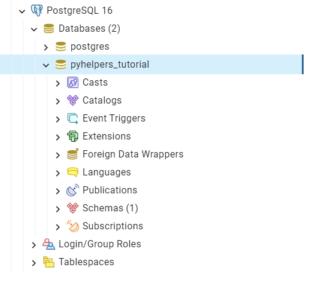
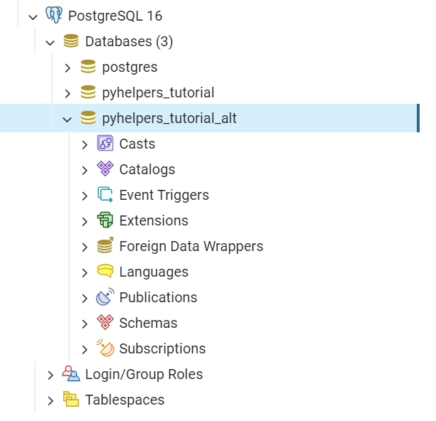
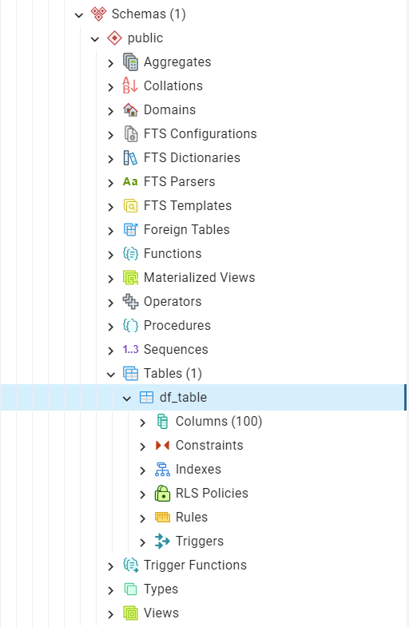
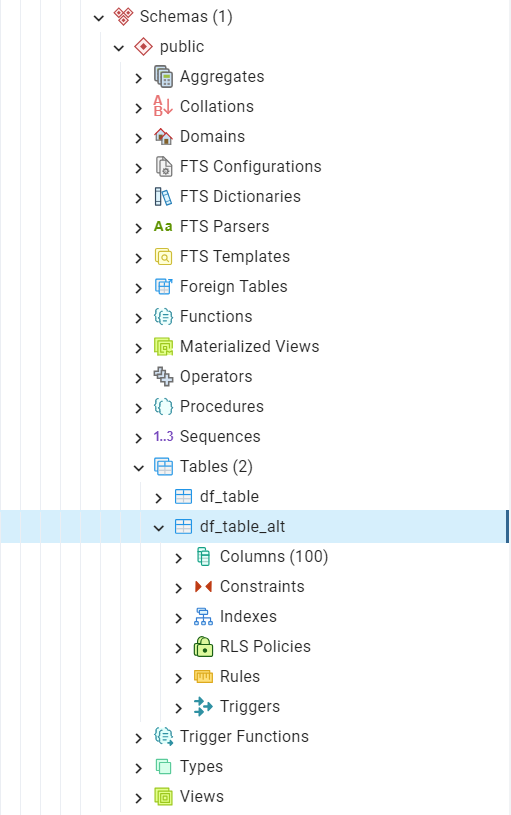

===========
Quick Start
===========

This quick-start tutorial provides some simple examples for each of the :doc:`modules`. These examples demonstrate the capabilities of `pyhelpers`_ in assisting with data manipulation tasks.

.. _quickstart-preparation:

Preparation - Create a data set
===============================

:doc:`< Back to Top <quick-start>` | :ref:`Next > <quickstart-settings-examples>`

Let's start by creating an example data set using `NumPy`_ and `Pandas`_, both of which are installed automatically with pyhelpers, as they are dependencies.

To demonstrate, we will use the `numpy.random.rand()`_ function to generate a 8×8 NumPy array of random samples drawn from a standard uniform distribution, naming the array ``random_array``:

.. code-block:: python

    >>> import numpy as np  # Import NumPy and abbreviate it to 'np'
    >>> np.random.seed(0)  # Ensure that the generated array data is reproducible
    >>> random_array = np.random.rand(8, 8)
    >>> random_array
    array([[0.5488135 , 0.71518937, 0.60276338, 0.54488318, 0.4236548 ,
            0.64589411, 0.43758721, 0.891773  ],
           [0.96366276, 0.38344152, 0.79172504, 0.52889492, 0.56804456,
            0.92559664, 0.07103606, 0.0871293 ],
           [0.0202184 , 0.83261985, 0.77815675, 0.87001215, 0.97861834,
            0.79915856, 0.46147936, 0.78052918],
           [0.11827443, 0.63992102, 0.14335329, 0.94466892, 0.52184832,
            0.41466194, 0.26455561, 0.77423369],
           [0.45615033, 0.56843395, 0.0187898 , 0.6176355 , 0.61209572,
            0.616934  , 0.94374808, 0.6818203 ],
           [0.3595079 , 0.43703195, 0.6976312 , 0.06022547, 0.66676672,
            0.67063787, 0.21038256, 0.1289263 ],
           [0.31542835, 0.36371077, 0.57019677, 0.43860151, 0.98837384,
            0.10204481, 0.20887676, 0.16130952],
           [0.65310833, 0.2532916 , 0.46631077, 0.24442559, 0.15896958,
            0.11037514, 0.65632959, 0.13818295]])
    >>> random_array.shape  # Check the shape of the array
    (8, 8)

Next, we will use `pandas.DataFrame()`_ to transform ``random_array`` into a Pandas DataFrame, naming it ``data_frame``:

.. code-block:: python

    >>> import pandas as pd  # Import Pandas and abbreviate it to 'pd'
    >>> data_frame = pd.DataFrame(random_array, columns=['col_' + str(x) for x in range(8)])
    >>> data_frame
          col_0     col_1     col_2  ...     col_5     col_6     col_7
    0  0.548814  0.715189  0.602763  ...  0.645894  0.437587  0.891773
    1  0.963663  0.383442  0.791725  ...  0.925597  0.071036  0.087129
    2  0.020218  0.832620  0.778157  ...  0.799159  0.461479  0.780529
    3  0.118274  0.639921  0.143353  ...  0.414662  0.264556  0.774234
    4  0.456150  0.568434  0.018790  ...  0.616934  0.943748  0.681820
    5  0.359508  0.437032  0.697631  ...  0.670638  0.210383  0.128926
    6  0.315428  0.363711  0.570197  ...  0.102045  0.208877  0.161310
    7  0.653108  0.253292  0.466311  ...  0.110375  0.656330  0.138183
    [8 rows x 8 columns]

.. seealso::

    - The example of `saving data as a Pickle file <#quickstart-store-saving-dataframe>`_.

.. _quickstart-settings-examples:

Altering display settings
=========================

:ref:`< Previous <quickstart-preparation>` | :doc:`Back to Top <quick-start>` | :ref:`Next > <quickstart-dirs-examples>`

The :mod:`pyhelpers.settings` module can be used to alter frequently-used parameters (of `GDAL`_, `Matplotlib`_, `NumPy`_ and `Pandas`_) to customise the working environment.

For example, we can apply the :func:`~pyhelpers.settings.np_preferences` function with its default parameters to get a neater view of ``random_array``:

.. code-block:: python

    >>> from pyhelpers.settings import np_preferences
    >>> # To round the numbers to four decimal places
    >>> np_preferences()  # By default, reset=False and precision=4
    >>> random_array
    array([[0.5488, 0.7152, 0.6028, 0.5449, 0.4237, 0.6459, 0.4376, 0.8918],
           [0.9637, 0.3834, 0.7917, 0.5289, 0.5680, 0.9256, 0.0710, 0.0871],
           [0.0202, 0.8326, 0.7782, 0.8700, 0.9786, 0.7992, 0.4615, 0.7805],
           [0.1183, 0.6399, 0.1434, 0.9447, 0.5218, 0.4147, 0.2646, 0.7742],
           [0.4562, 0.5684, 0.0188, 0.6176, 0.6121, 0.6169, 0.9437, 0.6818],
           [0.3595, 0.4370, 0.6976, 0.0602, 0.6668, 0.6706, 0.2104, 0.1289],
           [0.3154, 0.3637, 0.5702, 0.4386, 0.9884, 0.1020, 0.2089, 0.1613],
           [0.6531, 0.2533, 0.4663, 0.2444, 0.1590, 0.1104, 0.6563, 0.1382]])

To reset the display settings, set ``reset=True`` to revert to default values:

.. code-block:: python

    >>> np_preferences(reset=True)
    >>> random_array
    array([[0.54881350, 0.71518937, 0.60276338, 0.54488318, 0.42365480,
            0.64589411, 0.43758721, 0.89177300],
           [0.96366276, 0.38344152, 0.79172504, 0.52889492, 0.56804456,
            0.92559664, 0.07103606, 0.08712930],
           [0.02021840, 0.83261985, 0.77815675, 0.87001215, 0.97861834,
            0.79915856, 0.46147936, 0.78052918],
           [0.11827443, 0.63992102, 0.14335329, 0.94466892, 0.52184832,
            0.41466194, 0.26455561, 0.77423369],
           [0.45615033, 0.56843395, 0.01878980, 0.61763550, 0.61209572,
            0.61693400, 0.94374808, 0.68182030],
           [0.35950790, 0.43703195, 0.69763120, 0.06022547, 0.66676672,
            0.67063787, 0.21038256, 0.12892630],
           [0.31542835, 0.36371077, 0.57019677, 0.43860151, 0.98837384,
            0.10204481, 0.20887676, 0.16130952],
           [0.65310833, 0.25329160, 0.46631077, 0.24442559, 0.15896958,
            0.11037514, 0.65632959, 0.13818295]])

.. note::

    - The :func:`~pyhelpers.settings.np_preferences` function inherits the functionality of `numpy.set_printoptions()`_, with some modifications.

Similarly, the :func:`~pyhelpers.settings.pd_preferences` function alters a few `Pandas options and settings`_, such as display representation and maximum number of columns when displaying a DataFrame. Applying the function with default parameters allows us to view all eight columns with precision set to four decimal places.

.. code-block:: python

    >>> from pyhelpers.settings import pd_preferences
    >>> pd_preferences()  # By default, reset=False and precision=4
    >>> data_frame
       col_0  col_1  col_2  col_3  col_4  col_5  col_6  col_7
    0 0.5488 0.7152 0.6028 0.5449 0.4237 0.6459 0.4376 0.8918
    1 0.9637 0.3834 0.7917 0.5289 0.5680 0.9256 0.0710 0.0871
    2 0.0202 0.8326 0.7782 0.8700 0.9786 0.7992 0.4615 0.7805
    3 0.1183 0.6399 0.1434 0.9447 0.5218 0.4147 0.2646 0.7742
    4 0.4562 0.5684 0.0188 0.6176 0.6121 0.6169 0.9437 0.6818
    5 0.3595 0.4370 0.6976 0.0602 0.6668 0.6706 0.2104 0.1289
    6 0.3154 0.3637 0.5702 0.4386 0.9884 0.1020 0.2089 0.1613
    7 0.6531 0.2533 0.4663 0.2444 0.1590 0.1104 0.6563 0.1382

To reset the settings, use the parameter ``reset``; setting it to ``True`` reverts to default values, and setting it to ``'all'`` resets all Pandas options:

.. code-block:: python

    >>> pd_preferences(reset=True)
    >>> data_frame
          col_0     col_1     col_2  ...     col_5     col_6     col_7
    0  0.548814  0.715189  0.602763  ...  0.645894  0.437587  0.891773
    1  0.963663  0.383442  0.791725  ...  0.925597  0.071036  0.087129
    2  0.020218  0.832620  0.778157  ...  0.799159  0.461479  0.780529
    3  0.118274  0.639921  0.143353  ...  0.414662  0.264556  0.774234
    4  0.456150  0.568434  0.018790  ...  0.616934  0.943748  0.681820
    5  0.359508  0.437032  0.697631  ...  0.670638  0.210383  0.128926
    6  0.315428  0.363711  0.570197  ...  0.102045  0.208877  0.161310
    7  0.653108  0.253292  0.466311  ...  0.110375  0.656330  0.138183
    [8 rows x 8 columns]

.. note::

    - The functions in :mod:`pyhelpers.settings` handle only a few selected parameters based on the author's preferences. Feel free to modify the source code to suit your needs.

.. _quickstart-dirs-examples:

Specify a directory or file path
================================

:ref:`< Previous <quickstart-settings-examples>` | :doc:`Back to Top <quick-start>` | :ref:`Next > <quickstart-store-examples>`

The :mod:`pyhelpers.dirs` module aids in manipulating directories. For instance, the :func:`~pyhelpers.dirs.cd` function returns the absolute path to the current working directory, or to a specified subdirectory or file within it:

.. code-block:: python

    >>> from pyhelpers.dirs import cd
    >>> import os
    >>> cwd = cd()  # The current working directory
    >>> # Relative path of `cwd` to the current working directory
    >>> rel_path_cwd = os.path.relpath(cwd)
    >>> print(rel_path_cwd)
    .

To specify a path to a temporary folder named ``"pyhelpers_tutorial"``:

.. code-block:: python

    >>> # Name of a temporary folder for this tutorial
    >>> dir_name = "pyhelpers_tutorial"
    >>> # Path to the folder "pyhelpers_tutorial"
    >>> path_to_dir = cd(dir_name)
    >>> # Relative path of the directory
    >>> rel_dir_path = os.path.relpath(path_to_dir)
    >>> print(rel_dir_path)
    pyhelpers_tutorial

Check whether the directory ``"pyhelpers_tutorial\"`` exists:

.. code-block:: python

    >>> print(f'Does the directory "{rel_dir_path}\\" exist? {os.path.exists(path_to_dir)}')
    Does the directory "pyhelpers_tutorial\" exist? False

If the directory ``"pyhelpers_tutorial"`` does not exist, set the parameter ``mkdir=True`` to create it:

.. code-block:: python

    >>> # Set `mkdir` to `True` to create the "pyhelpers_tutorial" folder
    >>> path_to_dir = cd(dir_name, mkdir=True)
    >>> # Check again whether the directory "pyhelpers_tutorial" exists
    >>> print(f'Does the directory "{rel_dir_path}\\" exist? {os.path.exists(path_to_dir)}')
    Does the directory "pyhelpers_tutorial\" exist? True

When we specify a sequence of names (in order with a filename being the last), the :func:`~pyhelpers.dirs.cd` function would assume that all the names prior to the filename are folder names, which specify a path to the file. For example, to specify a path to a file named ``"quick_start.dat"`` within the ``"pyhelpers_tutorial"`` folder:

.. code-block:: python

    >>> # Name of the file
    >>> filename = "quick_start.dat"
    >>> # Path to the file named "quick_start.dat"
    >>> path_to_file = cd(dir_name, filename)  # path_to_file = cd(path_to_dir, filename)
    >>> # Relative path of the file "quick_start.dat"
    >>> rel_file_path = os.path.relpath(path_to_file)
    >>> print(rel_file_path)
    pyhelpers_tutorial\quick_start.dat

If any directories in the specified path do not exist, setting ``mkdir=True`` will create them. For example, to specify a data directory named ``"data"`` within the ``"pyhelpers_tutorial"`` folder:

.. code-block:: python

    >>> # Path to the data directory
    >>> data_dir = cd(dir_name, "data")  # equivalent to `cd(path_to_dir, "data")`
    >>> # Relative path of the data directory
    >>> rel_data_dir = os.path.relpath(data_dir)
    >>> print(rel_data_dir)
    pyhelpers_tutorial\data

We can then use the :func:`~pyhelpers.dirs.is_dir` function to check if ``data_dir`` (or ``rel_data_dir``) is a directory:

.. code-block:: python

    >>> from pyhelpers.dirs import is_dir
    >>> # Check if `rel_data_dir` is a directory
    >>> print(f'Does `rel_data_dir` specify a directory path? {is_dir(rel_data_dir)}')
    Does `rel_data_dir` specify a directory path? True
    >>> # Check if the data directory exists
    >>> print(f'Does the directory "{rel_data_dir}\\" exist? {os.path.exists(rel_data_dir)}')
    Does the directory "pyhelpers_tutorial\data\" exist? False

.. _quickstart-dirs-pickle-pathname:

For another example, to specify a path to a Pickle file, named ``"dat.pkl"``, in the directory ``"pyhelpers_tutorial\data\"``:

.. code-block:: python

    >>> # Name of the Pickle file
    >>> pickle_filename = "dat.pkl"
    >>> # Path to the Pickle file
    >>> path_to_pickle = cd(data_dir, pickle_filename)
    >>> # Relative path of the Pickle file
    >>> rel_pickle_path = os.path.relpath(path_to_pickle)
    >>> print(rel_pickle_path)
    pyhelpers_tutorial\data\dat.pkl

Check ``rel_pickle_path`` (or ``path_to_pickle``):

.. code-block:: python

    >>> # Check if `rel_pickle_path` is a directory
    >>> print(f'Is `rel_pickle_path` a directory? {os.path.isdir(rel_pickle_path)}')
    Is `rel_pickle_path` a directory? False
    >>> # Check if the file "dat.pkl" exists
    >>> print(f'Does the file "{rel_pickle_path}" exist? {os.path.exists(rel_pickle_path)}')
    Does the file "pyhelpers_tutorial\data\dat.pkl" exist? False

Let's now set ``mkdir=True`` to create any missing directories:

.. code-block:: python

    >>> path_to_pickle = cd(data_dir, pickle_filename, mkdir=True)
    >>> rel_data_dir = os.path.relpath(data_dir)
    >>> # Check again if the data directory exists
    >>> print(f'Does the directory "{rel_data_dir}" exist? {os.path.exists(rel_data_dir)}')
    Does the directory "pyhelpers_tutorial\data" exist? True
    >>> # Check again if the file "dat.pkl" exists
    >>> print(f'Does the file "{rel_pickle_path}" exist? {os.path.exists(rel_pickle_path)}')
    Does the file "pyhelpers_tutorial\data\dat.pkl" exist? False

[See also the example of `saving data as a Pickle file <#quickstart-store-saving-dataframe>`_.]

To delete the directory ``"pyhelpers_tutorial\"`` (including all its contents), we can use the :func:`~pyhelpers.dirs.delete_dir` function:

.. code-block:: python

    >>> from pyhelpers.dirs import delete_dir
    >>> # Delete the "pyhelpers_tutorial" directory
    >>> delete_dir(path_to_dir, verbose=True)
    To delete the directory "pyhelpers_tutorial\" (Not empty)
    ? [No]|Yes: yes
    Deleting "pyhelpers_tutorial\" ... Done.

.. _quickstart-store-examples:

Save and load data with Pickle files
====================================

:ref:`< Previous <quickstart-dirs-examples>` | :doc:`Back to Top <quick-start>` | :ref:`Next > <quickstart-geom-examples>`

The :mod:`pyhelpers.store` module can facilitate tasks such as saving and loading data using file-like objects in common formats such as `CSV`_, `JSON`_, and `Pickle`_.

.. _quickstart-store-saving-dataframe:

To demonstrate, let's save the ``data_frame`` created earlier (see :ref:`Preparation <quickstart-preparation>`) as a Pickle file using :func:`~pyhelpers.store.save_pickle`, and later retrieve it using :func:`~pyhelpers.store.load_pickle`. We'll use ``path_to_pickle`` from the directory specified in the :ref:`Specify a directory or a file path <quickstart-dirs-pickle-pathname>` section:

.. code-block:: python

    >>> from pyhelpers.store import save_pickle, load_pickle
    >>> # Save `data_frame` to "dat.pkl"
    >>> save_pickle(data_frame, path_to_pickle, verbose=True)
    Saving "dat.pkl" to "pyhelpers_tutorial\data\" ... Done.

We can now retrieve/load the data from ``path_to_pickle`` and store it as ``df_retrieved``:

.. code-block:: python

    >>> df_retrieved = load_pickle(path_to_pickle, verbose=True)
    Loading "pyhelpers_tutorial\data\dat.pkl" ... Done.

To verify if ``df_retrieved`` matches ``data_frame``:

.. code-block:: python

    >>> print(f'`df_retrieved` matches `data_frame`? {df_retrieved.equals(data_frame)}')
    `df_retrieved` matches `data_frame`? True

Before proceeding, let's delete the Pickle file (i.e. ``path_to_pickle``) and the associated directory that's been created:

.. code-block:: python

    >>> delete_dir(path_to_dir, verbose=True)
    To delete the directory "pyhelpers_tutorial\" (Not empty)
    ? [No]|Yes: yes
    Deleting "pyhelpers_tutorial\" ... Done.

.. note::

    - In the :mod:`pyhelpers.store` module, some functions such as :func:`~pyhelpers.store.save_spreadsheet` and :func:`~pyhelpers.store.save_spreadsheets` may require `openpyxl`_, `XlsxWriter`_ or `xlrd`_, which are not essential dependencies for the base installation of `pyhelpers`_. We could install them when needed via an appropriate method such as ``pip install``.

.. _quickstart-geom-examples:

Convert coordinates between OSGB36 and WGS84
============================================

:ref:`< Previous <quickstart-dirs-examples>` | :doc:`Back to Top <quick-start>` | :ref:`Next > <quickstart-text-examples>`

The :mod:`pyhelpers.geom` module can assist us in manipulating geometric and geographical data. For example, we can use the :func:`~pyhelpers.geom.osgb36_to_wgs84` function to convert geographical coordinates from `OSGB36`_ (British national grid) eastings and northings to `WGS84`_ longitudes and latitudes:

.. code-block:: python

    >>> from pyhelpers.geom import osgb36_to_wgs84
    >>> # Convert coordinates (easting, northing) to (longitude, latitude)
    >>> easting, northing = 530039.558844, 180371.680166  # London
    >>> longitude, latitude = osgb36_to_wgs84(easting, northing)
    >>> (longitude, latitude)
    (-0.12764738750268856, 51.507321895400686)

We can also use the function for bulk conversion of an array of OSGB36 coordinates:

.. code-block:: python

    >>> from pyhelpers._cache import example_dataframe
    >>> example_df = example_dataframe(osgb36=True)
    >>> example_df
                      Easting       Northing
    City
    London      530039.558844  180371.680166
    Birmingham  406705.887014  286868.166642
    Manchester  383830.039036  398113.055831
    Leeds       430147.447354  433553.327117
    >>> xy_array = example_df.to_numpy()
    >>> eastings, northings = xy_array.T
    >>> lonlat_array = osgb36_to_wgs84(eastings, northings, as_array=True)
    >>> lonlat_array
    array([[-0.12764739, 51.50732190],
           [-1.90269109, 52.47969920],
           [-2.24511479, 53.47948920],
           [-1.54379409, 53.79741850]])

Similarly, conversion from (longitude, latitude) back to (easting, northing) can be implemented using the function :func:`~pyhelpers.geom.wgs84_to_osgb36`:

.. code-block:: python

    >>> from pyhelpers.geom import wgs84_to_osgb36
    >>> longitudes, latitudes = lonlat_array.T
    >>> xy_array_ = wgs84_to_osgb36(longitudes, latitudes, as_array=True)
    >>> xy_array_
    array([[530039.55972534, 180371.67967567],
           [406705.88783629, 286868.16621896],
           [383830.03985454, 398113.05550332],
           [430147.44820845, 433553.32682598]])

.. note::

    - Conversion of coordinates between different systems may inevitably introduce minor errors, which are typically negligible.

Check if ``xy_array_`` is almost equal to ``xy_array``:

.. code-block:: python

    >>> eq_res = np.array_equal(np.round(xy_array, 2), np.round(xy_array_, 2))
    >>> print(f'Is `xy_array_` almost equal to `xy_array`? {eq_res}')
    Is `xy_array_` almost equal to `xy_array`? True

.. _quickstart-text-examples:

Find similar texts
==================

:ref:`< Previous <quickstart-geom-examples>` | :doc:`Back to Top <quick-start>` | :ref:`Next > <quickstart-ops-examples>`

The :mod:`pyhelpers.text` module can assist us in manipulating textual data. For example, suppose we have a word ``'angle'``, which is stored in a `str`_-type variable named ``word``, and a list of words, which is stored in a `list`_-type variable named ``lookup_list``; if we'd like to find from the list a one that is most similar to ``'angle'``, we can use the function :func:`~pyhelpers.text.find_similar_str`:

.. code-block:: python

    >>> from pyhelpers.text import find_similar_str
    >>> word = 'angle'
    >>> lookup_list = [
    ...     'Anglia',
    ...     'East Coast',
    ...     'East Midlands',
    ...     'North and East',
    ...     'London North Western',
    ...     'Scotland',
    ...     'South East',
    ...     'Wales',
    ...     'Wessex',
    ...     'Western']
    >>> # Find the most similar word to 'angle'
    >>> result_1 = find_similar_str(word, lookup_list)
    >>> result_1
    'Anglia'

By default, the function relies on `difflib`_ - a  built-in Python module. Alternatively, we can make use of an open-source package, `RapidFuzz`_, via setting the parameter ``engine='rapidfuzz'`` (or simply ``engine='fuzz'``):

.. code-block:: python

    >>> # Find the most similar word to 'angle' by using RapidFuzz
    >>> result_2 = find_similar_str(word, lookup_list, engine='fuzz')
    >>> result_2
    'Anglia'

.. note::

    - `RapidFuzz`_ is not a required dependency for basic `pyhelpers`_ functionality. We need to install it (e.g. ``pip install rapidfuzz``) to make the function run successfully with setting ``engine='rapidfuzz'`` (or ``engine='fuzz'``).

.. _quickstart-ops-examples:

Download an image file
======================

:ref:`< Previous <quickstart-text-examples>` | :doc:`Back to Top <quick-start>` | :ref:`Next > <quickstart-dbms-examples>`

The :mod:`pyhelpers.ops` module provides various helper functions for operations. For example, we can use :func:`~pyhelpers.ops.download_file_from_url` to download files from URLs.

Let's now try to download the `Python logo`_ image from its `official page <https://www.python.org/>`_. Firstly, we need to specify the URL of the image file:

.. code-block:: python

    >>> from pyhelpers.ops import download_file_from_url
    >>> # URL of a .png file of the Python logo
    >>> url = 'https://www.python.org/static/community_logos/python-logo-master-v3-TM.png'

Then, we need to specify a directory where we'd like to save the image file, and a filename for it; let's say we want to name the file ``"python-logo.png"`` and save it to the directory ``"pyhelpers_tutorial\images\"``:

.. code-block:: python

    >>> python_logo_filename = "python-logo.png"
    >>> # python_logo_file_path = cd(dir_name, "images", python_logo_filename)
    >>> python_logo_file_path = cd(path_to_dir, "images", python_logo_filename)
    >>> # Download the .png file of the Python logo
    >>> download_file_from_url(url, python_logo_file_path, verbose=False)

.. note::

    - By default, ``verbose=False`` prevents output during download.
    - Setting ``verbose=True`` (or ``verbose=1``) requires an the package `tqdm`_, which is not essential for installing pyhelpers. We can install it via ``pip install tqdm`` if necessary.

If we set ``verbose=True`` (given that `tqdm`_ is available in our working environment), the function will print out relevant information about the download progress as the file is being downloaded:

.. code-block:: python

    >>> download_file_from_url(url, python_logo_file_path, if_exists='replace', verbose=True)
    "pyhelpers_tutorial\images\python-logo.png": 81.6kB [00:00, 10.8MB/s]

.. note::

    - *'10.8MB/s'* shown at the end of the output is an estimated speed of downloading the file, which varies depending on network conditions at the time of running the function.
    - Setting ``if_exists='replace'`` (default) allows us to replace the image file that already exists at the specified destination.

Now let's have a look at the downloaded image file using `Pillow`_:

.. code-block:: python

    >>> from PIL import Image
    >>> python_logo = Image.open(python_logo_file_path)
    >>> python_logo.show()

.. figure:: _images/ops-download_file_from_url-demo.*
    :name: quickstart-ops-download_file_from_url-demo
    :align: center
    :width: 65%

    Python Logo (for illustrative purposes in this tutorial).

.. note::

    - In `Jupyter Notebook`_, we can use `IPython.display.Image`_ to display the image in the notebook by running ``IPython.display.Image(python_logo_file_path)``.

To delete ``"pyhelpers_tutorial\"`` and its subdirectories (including ``"pyhelpers_tutorial\images\"``), we can use the :func:`~pyhelpers.dirs.delete_dir` function again:

.. code-block:: python

    >>> delete_dir(path_to_dir, confirmation_required=False, verbose=True)
    Deleting "pyhelpers_tutorial\" ... Done.

Setting the parameter ``confirmation_required=False`` can allow us to delete the directory straightaway without typing a ``yes`` to confirm the action. The confirmation prompt is actually implemented through the :func:`~pyhelpers.ops.confirmed` function, which is also from the :mod:`pyhelpers.ops` module and can be helpful especially when we'd like to impose a manual confirmation before proceeding with certain actions. For example:

.. code-block:: python

    >>> from pyhelpers.ops import confirmed
    >>> # We can specify any prompting message as to what needs to be confirmed.
    >>> if confirmed(prompt="Continue? ..."):
    ...     print("OK! Go ahead.")
    Continue? ... [No]|Yes: yes
    OK! Go ahead.

.. note::

    - The response to the :func:`~pyhelpers.ops.confirmed` prompt is case-insensitive. It does not have to be exactly ``Yes`` for the function to return ``True``; responses such as ``yes``, ``Y`` or ``ye`` will also work. Conversely, responses such as ``no`` or ``n`` will return ``False``.
    - The :func:`~pyhelpers.ops.confirmed` function also includes a parameter ``confirmation_required``, which defaults to ``True``. If we set ``confirmation_required=False``, no confirmation is required, and the function will become ineffective and return ``True``.

.. _quickstart-dbms-examples:

Work with a PostgreSQL server
=============================

:ref:`< Previous <quickstart-ops-examples>` | :doc:`Back to Top <quick-start>` | :ref:`Next > <quickstart-the-end>`

The :mod:`pyhelpers.dbms` module provides a convenient way of communicating with `databases`_, such as `PostgreSQL`_ and `Microsoft SQL Server`_.

For example, the :class:`~pyhelpers.dbms.PostgreSQL` class can assist us in executing basic SQL statements on a PostgreSQL database server. To demonstrate its functionality, let's start by importing the class:

.. code-block:: python

    >>> from pyhelpers.dbms import PostgreSQL

.. _quickstart-dbms-examples-connect-db:

Connect to a database
---------------------

Now, we can create an instance of the class :class:`~pyhelpers.dbms.PostgreSQL` to connect to a PostgreSQL server by specifying key parameters, including ``host``, ``port``, ``username``, ``database_name`` and ``password``.

.. note::

    - If ``host``, ``port``, ``username`` and ``database_name`` are unspecified, their associated default attributes (namely, :attr:`~pyhelpers.dbms.PostgreSQL.DEFAULT_HOST`, :attr:`~pyhelpers.dbms.PostgreSQL.DEFAULT_PORT`, :attr:`~pyhelpers.dbms.PostgreSQL.DEFAULT_USERNAME` and :attr:`~pyhelpers.dbms.PostgreSQL.DEFAULT_DATABASE`) are used to instantiate the class, in which case we will connect to the default PostgreSQL server (as is installed on a PC).
    - If the specified ``database_name`` does not exist, it will be automatically created during the class instantiation.
    - Usually, we do not specify the parameter ``password`` explicitly in our code. Leaving it as ``None`` by default, we will be prompted to type it manually when instantiating the class.

For example, let's create an instance named ``postgres`` and establish a connection with a database named "*pyhelpers_tutorial*", hosted on the default PostgreSQL server:

.. code-block:: python

    >>> database_name = "pyhelpers_tutorial"
    >>> postgres = PostgreSQL(database_name=database_name, verbose=True)
    Password (postgres@localhost:5432): ***
    Creating a database: "pyhelpers_tutorial" ... Done.
    Connecting postgres:***@localhost:5432/pyhelpers_tutorial ... Successfully.

We can use `pgAdmin`_, the most popular graphical management tool for PostgreSQL, to check whether the database "*pyhelpers_tutorial*" exists in the **Databases** tree of the default server, as illustrated in :numref:`quickstart-dbms-examples-db-1`:

    The database "*pyhelpers_tutorial*".

Alternatively, we can use the :meth:`~pyhelpers.dbms.PostgreSQL.database_exists` method:

.. code-block:: python

    >>> res = postgres.database_exists(database_name)
    >>> print(f'Does the database "{database_name}" exist? {res}')
    Does the database "pyhelpers_tutorial" exist? True
    >>> print(f'We are currently connected to the database "{postgres.database_name}".')
    We are currently connected to the database "pyhelpers_tutorial".

On the same server, we can create multiple databases. For example, let's create another database named "*pyhelpers_tutorial_alt*" using the :meth:`~pyhelpers.dbms.PostgreSQL.create_database`  method:

.. code-block:: python

    >>> database_name_ = "pyhelpers_tutorial_alt"
    >>> postgres.create_database(database_name_, verbose=True)
    Creating a database: "pyhelpers_tutorial_alt" ... Done.

As we can see in :numref:`quickstart-dbms-examples-db-2`, the database "*pyhelpers_tutorial_alt*" has now been added to the default **Databases** tree:

    The database "*pyhelpers_tutorial_alt*".

.. note::

    - When a new database is created, the instance ``postgres`` disconnects from the current database and connects to the new one.

Check whether "*pyhelpers_tutorial_alt*" is the currently connected database:

.. code-block:: python

    >>> res = postgres.database_exists("pyhelpers_tutorial_alt")
    >>> print(f'Does the database "{database_name_}" exist? {res}')
    Does the database "pyhelpers_tutorial_alt" exist? True
    >>> print(f'We are currently connected to the database "{postgres.database_name}".')
    We are currently connected to the database "pyhelpers_tutorial_alt".

To reconnect to "*pyhelpers_tutorial*" (``database_name``), we can use the :meth:`~pyhelpers.dbms.PostgreSQL.connect_database` method:

.. code-block:: python

    >>> postgres.connect_database(database_name, verbose=True)
    Connecting postgres:***@localhost:5432/pyhelpers_tutorial ... Successfully.
    >>> print(f'We are currently connected to the database "{postgres.database_name}".')
    We are now connected with the database "pyhelpers_tutorial".

.. _quickstart-dbms-examples-import-data:

Import data into a database
---------------------------

With the established connection to the database, we can use the :meth:`~pyhelpers.dbms.PostgreSQL.import_data` method to import the ``data_frame`` (created in the :ref:`Preparation<quickstart-preparation>` section) into a table named "*df_table*" under the default schema "*public*":

.. code-block:: python

    >>> table_name = "df_table"
    >>> postgres.import_data(data=data_frame, table_name=table_name, verbose=True)
    To import data into the table "public"."df_table" at postgres:***@localhost:5432/...
    ? [No]|Yes: yes
    Importing the data into "public"."df_table" ... Done.

We should now see the table in pgAdmin, as shown in :numref:`quickstart-dbms-examples-df_table`:

    The table "*public*"."*df_table*".

The method :meth:`~pyhelpers.dbms.PostgreSQL.import_data` relies on the method `pandas.DataFrame.to_sql()`_, with the ``method`` parameter set to ``'multi'`` by default. Optionally, we can also use the method :meth:`~pyhelpers.dbms.PostgreSQL.psql_insert_copy` to significantly speed up data import, especially for large data sets.

Let's now try to import the same data into a table named "*df_table_alt*" by setting ``method=postgres.psql_insert_copy``:

.. code-block:: python

    >>> table_name_ = "df_table_alt"
    >>> postgres.import_data(
    ...     data=data_frame, table_name=table_name_, method=postgres.psql_insert_copy,
    ...     verbose=True)
    To import data into the table "public"."df_table_alt" at postgres:***@localhost:5432/...
    ? [No]|Yes: yes
    Importing the data into "public"."df_table_alt" ... Done.

In pgAdmin, we can see the table has been added to the **Tables** list, as shown in :numref:`quickstart-dbms-examples-df_table_alt`:

    The table "*public*"."*df_table_alt*".

.. _quickstart-dbms-examples-fetch-data:

Fetch data from a database
--------------------------

To retrieve the imported data, we can use the :meth:`~pyhelpers.dbms.PostgreSQL.read_table` method:

.. code-block:: python

    >>> df_retrieval_1 = postgres.read_table(table_name)
    >>> res = df_retrieval_1.equals(data_frame)
    >>> print(f"Is `df_retrieval_1` equal to `data_frame`? {res}")
    Is `df_retrieval_1` equal to `data_frame`? True

Alternatively, we can use the :meth:`~pyhelpers.dbms.PostgreSQL.read_sql_query` method, which serves as a more flexible way of reading/querying data. It takes PostgreSQL query statements and can be much faster for large tables.

Let's try this method to fetch the same data from the table "*df_table_alt*":

.. code-block:: python

    >>> df_retrieval_2 = postgres.read_sql_query('SELECT * FROM "public"."df_table_alt"')
    >>> res = df_retrieval_2.round(8).equals(df_retrieval_1.round(8))
    >>> print(f"Is `df_retrieval_2` equal to `df_retrieval_1`? {res}")
    Is `df_retrieval_2` equal to `df_retrieval_1`? True

.. note::

    - For the :meth:`~pyhelpers.dbms.PostgreSQL.read_sql_query` method, any PostgreSQL query statement that is passed to ``sql_query`` should NOT end with ``';'``.

.. _quickstart-dbms-examples-delete-data:

Delete data
-----------

Before we leave this notebook, let's clear up the databases and tables we've created.

We can delete/drop a table (e.g. "*df_table*") using the :meth:`~pyhelpers.dbms.PostgreSQL.drop_table` method:

.. code-block:: python

    >>> postgres.drop_table(table_name=table_name, verbose=True)
    To drop the table "public"."df_table" from postgres:***@localhost:5432/pyhelpers_tutorial
    ? [No]|Yes: yes
    Dropping "public"."df_table" ... Done.

To delete/drop a database, we can use the :meth:`~pyhelpers.dbms.PostgreSQL.drop_database` method:

.. code-block:: python

    >>> # Drop "pyhelpers_tutorial" (i.e. the currently connected database)
    >>> postgres.drop_database(verbose=True)
    To drop the database "pyhelpers_tutorial" from postgres:***@localhost:5432
    ? [No]|Yes: yes
    Dropping "pyhelpers_tutorial" ... Done.
    >>> # Drop "pyhelpers_tutorial_alt"
    >>> postgres.drop_database(database_name=database_name_, verbose=True)
    To drop the database "pyhelpers_tutorial_alt" from postgres:***@localhost:5432
    ? [No]|Yes: yes
    Dropping "pyhelpers_tutorial_alt" ... Done.

Check the currently connected database:

.. code-block:: python

    >>> print(f"We are currently connected with the database \"{postgres.database_name}\".")
    We are currently connected with the database "postgres".

Now we have removed all the databases created in this notebook and restored the PostgreSQL server to its original status.

|

.. _quickstart-the-end:

:ref:`< Previous <quickstart-dbms-examples>` | :doc:`Back to Top <quick-start>`

----------------------------------------------

Any issues regarding the use of pyhelpers are welcome and should be logged/reported onto `Issue Tracker`_.

For more details and examples, check :doc:`modules`.

.. _`pyhelpers`: https://pypi.org/project/pyhelpers/

.. _`NumPy`: https://numpy.org
.. _`Pandas`: https://pandas.pydata.org
.. _`numpy.random.rand()`: https://numpy.org/doc/stable/reference/random/generated/numpy.random.rand.html
.. _`pandas.DataFrame()`: https://pandas.pydata.org/pandas-docs/stable/user_guide/dsintro.html#dataframe
.. _`numpy.set_printoptions()`: https://numpy.org/doc/stable/reference/generated/numpy.set_printoptions.html
.. _`Pandas options and settings`: https://pandas.pydata.org/pandas-docs/stable/user_guide/options.html

.. _`Matplotlib`: https://matplotlib.org
.. _`GDAL`: https://gdal.org

.. _`Pickle`: https://docs.python.org/3/library/pickle.html
.. _`CSV`: https://en.wikipedia.org/wiki/Comma-separated_values
.. _`JSON`: https://www.json.org/json-en.html

.. _openpyxl: https://pypi.org/project/openpyxl/
.. _XlsxWriter: https://pypi.org/project/XlsxWriter/
.. _xlrd: https://pypi.org/project/xlrd/

.. _`OSGB36`: https://en.wikipedia.org/wiki/Ordnance_Survey_National_Grid
.. _`WGS84`: https://en.wikipedia.org/wiki/World_Geodetic_System

.. _`str`: https://docs.python.org/3/library/stdtypes.html#textseq
.. _`list`: https://docs.python.org/3/library/stdtypes.html#list
.. _`difflib`: https://docs.python.org/3/library/difflib.html
.. _`RapidFuzz`: https://pypi.org/project/rapidfuzz/

.. _`Python logo`: https://www.python.org/static/community_logos/python-logo-master-v3-TM.png
.. _`tqdm`: https://pypi.org/project/tqdm/
.. _`Pillow`: https://python-pillow.org/
.. _`Jupyter Notebook`: https://jupyter.org/
.. _`IPython.display.Image`: https://ipython.readthedocs.io/en/stable/api/generated/IPython.display.html#IPython.display.Image

.. _`databases`: https://en.wikipedia.org/wiki/Database
.. _`PostgreSQL`: https://www.postgresql.org/
.. _`Microsoft SQL Server`: https://www.microsoft.com/en-gb/sql-server
.. _`pgAdmin`: https://www.pgadmin.org/
.. _`pandas.DataFrame.to_sql()`: https://pandas.pydata.org/pandas-docs/stable/reference/api/pandas.DataFrame.to_sql.html

.. _`Issue Tracker`: https://github.com/mikeqfu/pyhelpers/issues
