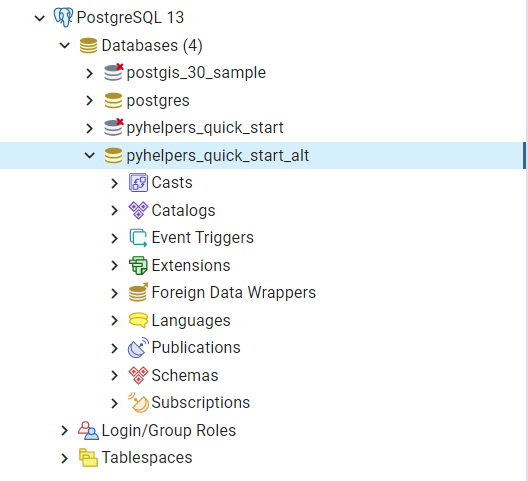

===========
Quick start
===========

The current release includes the following modules, with each containing a number of helper functions:

.. py:module:: pyhelpers
    :noindex:

.. autosummary::

    settings
    dir
    ops
    store
    geom
    text
    sql

As a quick tutorial to get started, this part of the documentation provides a few simple examples for each module, to demonstrate what the package could offer to assist you in manipulating your own data.

.. _settings-examples:

Change settings of working environment
======================================

The module :py:mod:`settings<pyhelpers.settings>` can be used to alter settings of `Pandas`_, `NumPy`_, `Matplotlib`_ and `GDAL`_ for your working environment. For example, the function :py:func:`pd_preferences()<pyhelpers.settings.pd_preferences>` alters a few default Pandas `options and settings`_ (providing ``reset=False``), such as representation and maximum number of columns when displaying a `pandas.DataFrame`_ in console:

.. code-block:: python

    >>> from pyhelpers.settings import pd_preferences  # from pyhelpers import pd_preferences

    >>> pd_preferences(reset=False)

The parameter ``reset`` is by default ``False``. When ``reset=True``, all parameters are reset to their default values.

.. note::

    The functions currently available in the module :py:mod:`settings<pyhelpers.settings>` controls only a few parameters (for PyHelper author's personal preference). To suit your own tastes, you can try to change the source code.

.. _dir-examples:

Specify a directory/file path
=============================

The module :py:mod:`dir<pyhelpers.dir>` can be used to assist in manipulating folders/directories. For example, the function :py:func:`cd()<pyhelpers.dir.cd>` returns an absolute path to the current working directory (and any of its sub-directories/files):

.. code-block:: python

    >>> from pyhelpers.dir import cd  # from pyhelpers import cd

    >>> cwd = cd()  # The current working directory

    >>> import os

    >>> rel_path_cwd = os.path.relpath(cwd)  # Relative path of `cwd` to the current working directory
    >>> print(rel_path_cwd)
    .

To direct to a temporary folder, named *"pyhelpers_quick_start"*, for this tutorial:

.. code-block:: python

    >>> qs_dirname = "pyhelpers_quick_start"  # Name of a temporary folder for this tutorial

    >>> path_to_qs = cd(qs_dirname)  # Path to the folder "pyhelpers_quick_start"

    >>> rel_path_qs = os.path.relpath(path_to_qs)  # Relative path of the directory
    >>> print(rel_path_qs)
    pyhelpers_quick_start

Check whether the directory *"pyhelpers_quick_start\\"* exists:

.. code-block:: python

    >>> print("The directory \"{}\\\" exists? {}".format(rel_path_qs, os.path.exists(path_to_qs)))
    The directory "pyhelpers_quick_start\" exists? False

In the case that the directory *"pyhelpers_quick_start\\"* does not exist, you could set the parameter ``mkdir`` (which defaults to ``False``) to be ``True``, and the folder will be created as the path is specified:

.. code-block:: python

    >>> # Set `mkdir` to be `True` to create a folder named "pyhelpers_quick_start"
    >>> path_to_qs = cd(qs_dirname, mkdir=True)

    >>> # Whether the directory "pyhelpers_quick_start\" exists now
    >>> print("The directory \"{}\\\" exists? {}".format(rel_path_qs, os.path.exists(path_to_qs)))
    The directory "pyhelpers_quick_start\" exists? True

If you provide a filename (with a file extension), you can then get an absolute path to the file. For example:

.. code-block:: python

    >>> dat_filename = "quick_start.dat"  # Specify a filename

    >>> dat_file_path = cd(qs_dirname, dat_filename)  # Path to the file named "quick_start.dat"
    >>> # equivalent to: dat_file_path = cd(path_to_qs, dat_filename)

    >>> dat_rel_path = os.path.relpath(dat_file_path)  # Relative path of the file "quick_start.dat"
    >>> print(dat_rel_path)
    pyhelpers_quick_start\quick_start.dat

When only one filename (with a file extension) is provided and ``mkdir=True``, the function will only create the folder (if it does not exist) for the file, rather than taking the filename as a folder name.

.. _pickle-file-path:

See the following example:

.. code-block:: python

    >>> from pyhelpers.dir import is_dirname

    >>> data_dir = cd(path_to_qs, "data")  # A data directory "pyhelpers_quick_start\data"
    >>> rel_path_data = os.path.relpath(data_dir)  # Relative path of the data directory

    >>> # Whether `rel_path_data` is a directory
    >>> print("\"{}\\\" is a directory? {}".format(rel_path_data, is_dirname(rel_path_data)))
    "pyhelpers_quick_start\data\" is a directory? True

    >>> # Whether the data directory exists
    >>> print("The directory \"{}\\\" exists? {}".format(rel_path_data, os.path.exists(data_dir)))
    The directory "pyhelpers_quick_start\data\" exists? False

    >>> pickle_filename = "dat.pickle"  # Name of a Pickle data file

    >>> pickle_file_path = cd(data_dir, pickle_filename)  # Path to the pickle file "dat.pickle"
    >>> print(os.path.relpath(pickle_file_path))  # Relative path of the pickle file
    pyhelpers_quick_start\data\dat.pickle

    >>> # Whether `pickle_file_path` is a directory
    >>> print("`pickle_file_path` is a directory? {}".format(os.path.isdir(pickle_file_path)))
    `pickle_file_path` is a directory? False

    >>> # Check again whether the file "dat.pickle" exists
    >>> print("The file \"{}\" exists? {}".format(pickle_filename, os.path.exists(pickle_file_path)))
    The file "dat.pickle" exists? False

    >>> # Set `mkdir` to be `True` to create the data folder
    >>> pickle_file_path = cd(data_dir, pickle_filename, mkdir=True)

    >>> # Whether the data directory exists now
    >>> print("The directory \"{}\\\" exists? {}".format(rel_path_data, os.path.exists(data_dir)))
    The directory "pyhelpers_quick_start\data\" exists? True

    >>> # Check again whether the file "dat.pickle" exists
    >>> print("The file \"{}\" exists? {}".format(pickle_filename, os.path.exists(pickle_file_path)))
    The file "dat.pickle" exists? False

To delete the directory *"pyhelpers_quick_start\\"*, you can use the function :py:func:`delete_dir()<pyhelpers.dir.delete_dir>`:

.. code-block:: python

    >>> from pyhelpers.dir import delete_dir  # from pyhelpers import delete_dir

    >>> delete_dir(path_to_qs, verbose=True)  # Delete the directory "pyhelpers_quick_start\"
    The directory "pyhelpers_quick_start\" is not empty.
    Confirmed to delete it? [No]|Yes: yes
    Deleting "pyhelpers_quick_start\" ... Done.

Download an image file
======================

The module :py:mod:`ops<pyhelpers.ops>` is intended to provide a miscellany of helper functions.

.. code-block:: python

    >>> from pyhelpers.ops import download_file_from_url
    >>> # from pyhelpers import download_file_from_url

For example, you can use the function :py:func:`download_file_from_url()<pyhelpers.ops.download_file_from_url>` to download files from a given URL.

.. note::

    The function :py:func:`download_file_from_url()<pyhelpers.ops.download_file_from_url>` requires `requests`_ (and, if ``verbose=True``, `tqdm`_).

Suppose you would like to download a Python logo from the homepage of `Python`_, firstly, specify the URL:

.. code-block:: python

    >>> url = 'https://www.python.org/static/community_logos/python-logo-master-v3-TM.png'

Then specify where you would like to save the .png file and what the filename it would be. For example, to name the file as *"python-logo.png"* and save it to the directory *"pyhelpers_quick_start\\images\\"*:

.. code-block:: python

    >>> python_logo_filename = "python-logo.png"
    >>> python_logo_file_path = cd(path_to_qs, "images", python_logo_filename)

    >>> download_file_from_url(url, python_logo_file_path)

You may view the downloaded picture by using `Pillow`_:

.. code-block:: python

    >>> from PIL import Image

    >>> python_logo = Image.open(python_logo_file_path)
    >>> python_logo.show()

If you are using Jupyter Notebook, you can also view the picture using `IPython.display.Image`_:

.. figure:: _images/python-logo-qs.*
    :name: python-logo-qs
    :align: center
    :width: 65%

    The Python Logo.

Again, if you would like to delete the download directory, *"pyhelpers_quick_start\\images\\"* as well as *"pyhelpers_quick_start\\"*, use the function :py:func:`delete_dir()<pyhelpers.dir.delete_dir>`:

.. code-block:: python

    >>> delete_dir(path_to_qs, confirmation_required=False, verbose=True)
    Deleting "pyhelpers_quick_start\" ... Done.

From the module :py:mod:`ops<pyhelpers.ops>`, the function :py:func:`confirmed()<pyhelpers.ops.confirmed>` may be quite helpful especially when you would like to request a confirmation before proceeding with some processes. For example:

.. code-block:: python

    >>> from pyhelpers.ops import confirmed  # from pyhelpers import confirmed

.. code-block:: python

    >>> if confirmed(prompt="Continue? ...", confirmation_required=True):
    ...     print("Go ahead.")
    Continue? ... [No]|Yes: yes
    Go ahead.

.. note::

    - You may specify the prompting message as to the confirmation by altering the value of ``prompt``.

    - If you type ``Yes`` (or ``Y``, ``yes``, or something like ``ye``), it should return ``True``; otherwise, ``False`` (if the input being *No* or *n*).

    - By setting ``confirmation_required=False``, a confirmation is not required, in which case this function will become ineffective as it just returns ``True``.

.. _store-examples:

Save and load data with Pickle
==============================

The module :py:mod:`store<pyhelpers.store>` can be used to help save and load data. Some functions from this module require `openpyxl`_, `XlsxWriter`_ and/or `xlrd`_, which have been installed along with the installation of PyHelpers.

Before proceeding to the examples for this module, let’s create a `pandas.DataFrame`_ first:

.. _store-xy-array:
.. _store-dat:

.. code-block:: python

    >>> import numpy as np
    >>> import pandas as pd

    >>> # Create a data frame
    >>> xy_array = np.array([(530034, 180381),   # London
    ...                      (406689, 286822),   # Birmingham
    ...                      (383819, 398052),   # Manchester
    ...                      (582044, 152953)],  # Leeds
    ...                     dtype=np.int64)
    >>> idx_labels = ['London', 'Birmingham', 'Manchester', 'Leeds']
    >>> col_names = ['Easting', 'Northing']
    >>> dat = pd.DataFrame(xy_array, index=idx_labels, columns=col_names)

    >>> print(dat)
                Easting  Northing
    London       530034    180381
    Birmingham   406689    286822
    Manchester   383819    398052
    Leeds        582044    152953

If you would like to save ``dat`` as a `pickle`_ file and retrieve it later, use the functions :py:func:`save_pickle()<pyhelpers.store.save_pickle>` and :py:func:`load_pickle()<pyhelpers.store.load_pickle>`:

.. code-block:: python

    >>> from pyhelpers.store import save_pickle, load_pickle
    >>> # from pyhelpers import save_pickle, load_pickle

For example, to save ``dat`` to ``pickle_file_path`` (see the :ref:`pickle_file_path<pickle-file-path>` specified above):

.. code-block:: python

    >>> save_pickle(dat, pickle_file_path, verbose=True)
    Saving "dat.pickle" to "pyhelpers_quick_start\data" ... Done.

To retrieve ``dat`` from ``pickle_file_path``:

.. code-block:: python

    >>> dat_retrieved = load_pickle(pickle_file_path, verbose=True)
    Loading "pyhelpers_quick_start\data\dat.pickle" ... Done.

``dat_retrieved`` should be equal to ``dat``:

.. code-block:: python

    >>> # Check whether `dat_retrieved` is equal to `dat`
    >>> print("`dat_retrieved` is equal to `dat`? {}".format(dat_retrieved.equals(dat)))
    `dat_retrieved` is equal to `dat`? True

The :ref:`pyhelpers.store<store>` module also have functions for saving/loading data of some other formats, such as ``.csv``, ``.txt``, ``.json``, ``.xlsx`` (or ``.xls``) and ``.feather``.

Now, before you move on, you can delete the directory *"pyhelpers_quick_start\\"* (i.e. ``path_to_qs``) to clear up the mess that have been produced so far:

.. code-block:: python

    >>> delete_dir(path_to_qs, confirmation_required=False, verbose=True)
    Deleting "pyhelpers_quick_start\" ... Done.

.. _geom-examples:

Convert coordinates between OSGB36 and WGS84
============================================

The module :py:mod:`geom<pyhelpers.geom>` can be used to assist in manipulating geometric and geographical data.

For example, to convert coordinates from `OSGB36`_ (British national grid) to `WGS84`_ (latitude and longitude), you can use the function :py:func:`osgb36_to_wgs84()<pyhelpers.geom.osgb36_to_wgs84>`:

.. note::

    The function :py:func:`osgb36_to_wgs84()<pyhelpers.geom.osgb36_to_wgs84>` requires `pyproj`_.

.. code-block:: python

    >>> from pyhelpers.geom import osgb36_to_wgs84  # from pyhelpers import osgb36_to_wgs84

To convert coordinate of a single point ``(530034, 180381)``:

.. code-block:: python

    >>> easting, northing = 530034, 180381  # London

    >>> lon, lat = osgb36_to_wgs84(easting, northing)  # Longitude and latitude

    >>> print((lon, lat))
    (-0.12772400574286916, 51.50740692743041)

To convert an array of OSGB36 coordinates (e.g. ``xy_array``, see the :ref:`example<store-xy-array>` above):

.. code-block:: python

    >>> eastings, northings = xy_array.T

    >>> lonlat_array = np.array(osgb36_to_wgs84(eastings, northings))

    >>> print(lonlat_array.T)
    [[-0.12772401 51.50740693]
     [-1.90294064 52.47928436]
     [-2.24527795 53.47894006]
     [ 0.60693267 51.24669501]]

Similarly, you can use the function :py:func:`wgs84_to_osgb36()<pyhelpers.geom.wgs84_to_osgb36>` to convert from the latitude/longitude (`WGS84`_) coordinates back to easting/northing (`OSGB36`_).

.. _text-examples:

Find similar texts
==================

The module :ref:`pyhelpers.text<text>` can be used to assist in manipulating textual data.

For example, if you have a `str`_ type variable named ``string`` and would like to find the most similar one from a list of words, ``lookup_list``, you can use the function :py:func:`find_similar_str()<pyhelpers.text.find_similar_str>`:

.. code-block:: python

    >>> from pyhelpers.text import find_similar_str  # from pyhelpers import find_similar_str

    >>> string = 'ang'
    >>> lookup_list = ['Anglia',
    ...                'East Coast',
    ...                'East Midlands',
    ...                'North and East',
    ...                'London North Western',
    ...                'Scotland',
    ...                'South East',
    ...                'Wales',
    ...                'Wessex',
    ...                'Western']

    >>> # Find the most similar word to 'ang'
    >>> result_1 = find_similar_str(string, lookup_list, processor='difflib')

    >>> print(result_1)
    Anglia

The parameter ``processor`` for the function is by default ``'difflib'``, meaning that it would use the Python package `difflib`_ to perform the task.

Alternatively, you could also turn to `FuzzyWuzzy`_ by setting ``processor`` to be ``'fuzzywuzzy'``:

.. note::

    `FuzzyWuzzy`_ is not required for the installation of PyHelpers (>=1.2.15). If it is not yet available on your system, you have to install it before you can proceed with setting ``processor='fuzzywuzzy'``.

.. code-block:: python

    >>> # Find the most similar word to 'ang' by using NLTK
    >>> result_2 = find_similar_str(string, lookup_list, processor='fuzzywuzzy')

    >>> print(result_2)
    Anglia

.. _sql-examples:

Work with PostgreSQL database
=============================

The module :py:mod:`sql<pyhelpers.sql>` provides a convenient way to establish a connection with a SQL database.

The current release of PyHelpers contains only :py:class:`PostgreSQL<pyhelpers.sql.PostgreSQL>` class that allows us to implement some basic queries in a `PostgreSQL`_ database.

.. code-block:: python

    >>> from pyhelpers.sql import PostgreSQL  # from pyhelpers import PostgreSQL

.. note::

    The constructor method of the class :py:class:`PostgreSQL<pyhelpers.sql.PostgreSQL>` relies on `SQLAlchemy`_ and `psycopg2`_ to successfully create an instance of the class.

Connect to a database
---------------------

After the class :py:class:`PostgreSQL<pyhelpers.sql.PostgreSQL>` is successfully imported, you can use it to connect a PostgreSQL server by specifying the parameters: ``host``, ``port``, ``username``, ``database_name`` and, of course, ``password``.

.. note::

    ``password`` is by default ``None``. If you do not wish to specify the password explicitly in your script, then you will be asked to type in the password manually when you create an instance of the class.

For example, to create an instance named ``pgdb`` and connect to a database named *"pyhelpers_quick_start"*:

.. code-block:: python

    >>> pgdb = PostgreSQL(host='localhost', port=5432, username='postgres',
    ...                   database_name="pyhelpers_quick_start", password=None)
    Password (postgres@localhost:5432): ***
    Connecting postgres:***@localhost:5432/pyhelpers_quick_start ... Successfully.

.. figure:: _images/qs-sql-test-db-1.png
    :name: qs-sql-test-db-1
    :align: center
    :width: 60%

    The database *"pyhelpers_quick_start"*.

.. note::

    - Similar to ``password``, if any of the other parameters is ``None``, you will also be asked to type in the information.

    - If the database *"pyhelpers_quick_start"* does not exist, it will be created as you create the instance ``pgdb``.

To create another database named *"pyhelpers_quick_start_alt"*:

.. code-block:: python

    >>> pgdb.create_database("pyhelpers_quick_start_alt", verbose=True)
    Creating a database: "pyhelpers_quick_start_alt" ... Done.

To check if the database has been successfully created:

.. code-block:: python

    >>> print("The database being currently connected is \"{}\".".format(pgdb.database_name))
    The database being currently connected is "pyhelpers_quick_start_alt".

    >>> res = pgdb.database_exists("pyhelpers_quick_start_alt")
    >>> print("The database \"{}\" is successfully created? {}".format(pgdb.database_name, res))
    The database "pyhelpers_quick_start_alt" is successfully created? True

    The database *"pyhelpers_quick_start_alt"*.

.. note::

    Once a new database is created, the instance ``pgdb`` is by default connected with the new database *"pyhelpers_quick_start_alt"*.

If you would like to connect back to *"pyhelpers_quick_start"*:

.. code-block:: python

    >>> pgdb.connect_database("pyhelpers_quick_start", verbose=True)
    Connecting postgres:***@localhost:5432/pyhelpers_quick_start ... Successfully.

    >>> print("The database being currently connected is \"{}\".".format(pgdb.database_name))
    The database being currently connected is "pyhelpers_quick_start".

Import data into the database
-----------------------------

After the database connection has been established, you can use the method :py:meth:`.import_data()<pyhelpers.sql.PostgreSQL.import_data>` to import ``dat`` (see the :ref:`example<store-dat>` above) into a table named *"dat_tbl"*:

.. code-block:: python

    >>> pgdb.import_data(dat, table_name="dat_tbl", index=True, verbose=2)
    To import data into "public"."dat_tbl" at postgres:***@localhost:5432/pyhelpers_quick_start
    ? [No]|Yes: yes
    Importing the data into the table "public"."dat_tbl" ... Done.

The method :py:meth:`.import_data()<pyhelpers.sql.PostgreSQL.import_data>` relies on `pandas.DataFrame.to_sql`_, with the parameter ``'method'`` is set to be ``'multi'`` by default. However, it can also take a callable :py:meth:`.psql_insert_copy()<pyhelpers.sql.PostgreSQL.psql_insert_copy>` as an alternative ``'method'`` to significantly speed up importing data into the database. Try to import the same data into a table named *"dat_tbl_alt"* by setting ``method=pgdb.psql_insert_copy``:

.. code-block:: python

    >>> pgdb.import_data(dat, table_name="dat_tbl_alt", index=True, method=pgdb.psql_insert_copy,
    ...                  verbose=2)
    To import data into "public"."dat_tbl_alt" at postgres:***@localhost:5432/pyhelpers_quick_start
    ? [No]|Yes: yes
    Importing the data into the table "public"."dat_tbl_alt" ... Done.

Fetch data from the database
----------------------------

To retrieve the imported data, you can use the method :py:meth:`.read_table()<pyhelpers.sql.PostgreSQL.read_table>`:

.. code-block:: python

    >>> dat_retrieval_1 = pgdb.read_table("dat_tbl", index_col='index')
    >>> dat_retrieval_1.index.name = None

    >>> res = dat_retrieval_1.equals(dat)
    >>> print("`dat_retrieval_1` and `dat` have the same shape and elements? {}".format(res))
    `dat_retrieval_1` and `dat` have the same shape and elements? True

Alternatively, the method :py:meth:`.read_sql_query()<pyhelpers.sql.PostgreSQL.read_sql_query>` could be more flexible in reading/querying data by PostgreSQL statement (and could be much faster especially when the tabular data is fairly large). Here you can use this method to fetch the same data from the table *"dat_tbl_alt"*:

.. code-block:: python

    >>> sql_query = 'SELECT * FROM public.dat_tbl_alt'

    >>> dat_retrieval_2 = pgdb.read_sql_query(sql_query, index_col='index')
    >>> dat_retrieval_2.index.name = None

    >>> res = dat_retrieval_2.equals(dat_retrieval_1)
    >>> print(f"`dat_retrieval_2` and `dat_retrieval_1` have the same shape and elements? {res}")
    `dat_retrieval_2` and `dat_retrieval_1` have the same shape and elements? True

.. note::

    The parameter ``sql_query`` for the method :py:meth:`.read_sql_query()<pyhelpers.sql.PostgreSQL.read_sql_query>` must end without ``';'``.

Drop data
---------

To drop the table *"dat_tbl"*, you can use the method :py:meth:`.drop_table()<pyhelpers.sql.PostgreSQL.drop_table>`:

.. code-block:: python

    >>> pgdb.drop_table(table_name="dat_tbl", verbose=True)
    To drop the table "public"."dat_tbl" from postgres:***@localhost:5432/pyhelpers_quick_start
    ? [No]|Yes: yes
    Dropping "public"."dat_tbl" ... Done.

Note that you have created two databases: *"pyhelpers_quick_start"* (being currently connected) and *"pyhelpers_quick_start_alt"*. To remove both of them from the database, you can use the method :py:meth:`.drop_database()<pyhelpers.sql.PostgreSQL.drop_database>`.

.. code-block:: python

    >>> # Drop "pyhelpers_quick_start" (i.e. the currently connected database)
    >>> pgdb.drop_database(verbose=True)
    To drop the database "pyhelpers_quick_start" from postgres:***@localhost:5432
    ? [No]|Yes: yes
    Dropping "pyhelpers_quick_start" ... Done.

    >>> # Drop "pyhelpers_quick_start_alt"
    >>> pgdb.drop_database(database_name="pyhelpers_quick_start_alt", verbose=True)
    To drop the database "pyhelpers_quick_start_alt" from postgres:***@localhost:5432/postgres
    ? [No]|Yes: yes
    Dropping "pyhelpers_quick_start_alt" ... Done.

    >>> # Check the currently connected database
    >>> print("The database being currently connected is \"{}\".".format(pgdb.database_name))
    The database being currently connected is "postgres".

.. _`Python`: https://www.python.org/
.. _`Numpy`: https://numpy.org/
.. _`Pandas`: https://pandas.pydata.org/
.. _`pandas.DataFrame`: https://pandas.pydata.org/pandas-docs/stable/user_guide/dsintro.html#dataframe
.. _`Matplotlib`: https://matplotlib.org/
.. _`GDAL`: https://gdal.org/
.. _`options and settings`: https://pandas.pydata.org/pandas-docs/stable/user_guide/options.html
.. _`requests`: https://github.com/psf/requests
.. _`tqdm`: https://github.com/tqdm/tqdm
.. _`Pillow`: https://python-pillow.org/
.. _`IPython.display.Image`: https://ipython.readthedocs.io/en/stable/api/generated/IPython.display.html#IPython.display.Image
.. _`openpyxl`: https://openpyxl.readthedocs.io/en/stable/
.. _`XlsxWriter`: https://xlsxwriter.readthedocs.io
.. _`xlrd`: https://xlrd.readthedocs.io/en/latest/
.. _`pickle`: https://docs.python.org/3/library/pickle.html
.. _`pyproj`: https://github.com/pyproj4/pyproj
.. _`OSGB36`: https://en.wikipedia.org/wiki/Ordnance_Survey_National_Grid
.. _`WGS84`: https://en.wikipedia.org/wiki/World_Geodetic_System
.. _`str`: https://docs.python.org/3/library/stdtypes.html#textseq
.. _`difflib`: https://docs.python.org/3/library/difflib.html
.. _`FuzzyWuzzy`: https://github.com/seatgeek/fuzzywuzzy/
.. _`PostgreSQL`: https://www.postgresql.org/
.. _`SQLAlchemy`: https://www.sqlalchemy.org/
.. _`psycopg2`: https://www.psycopg.org/
.. _`pandas.DataFrame.to_sql`: https://pandas.pydata.org/pandas-docs/stable/reference/api/pandas.DataFrame.to_sql.html

|

**(The end of the quick start)**

For more details and examples, check :ref:`Modules<modules>`.
