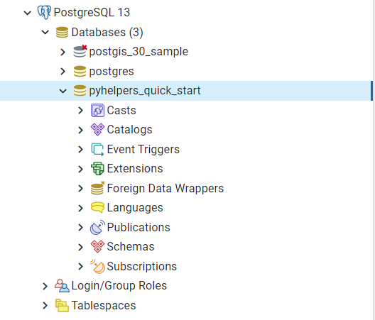
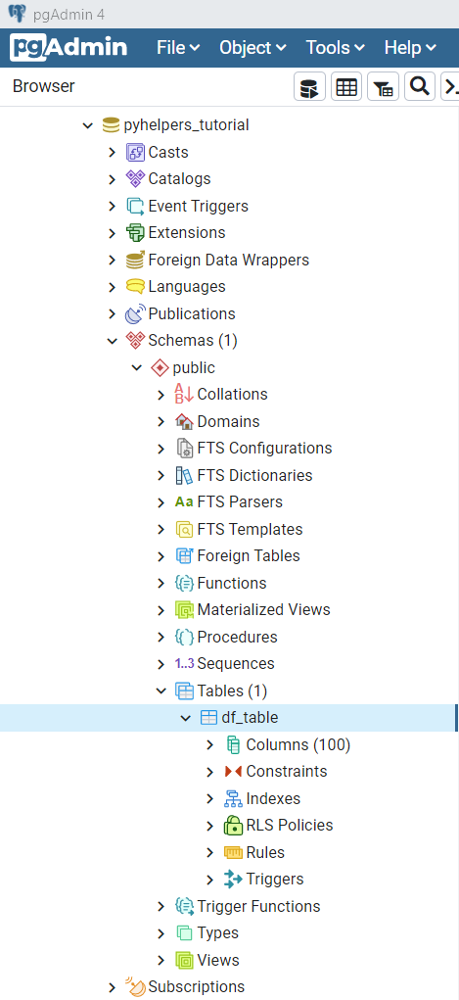
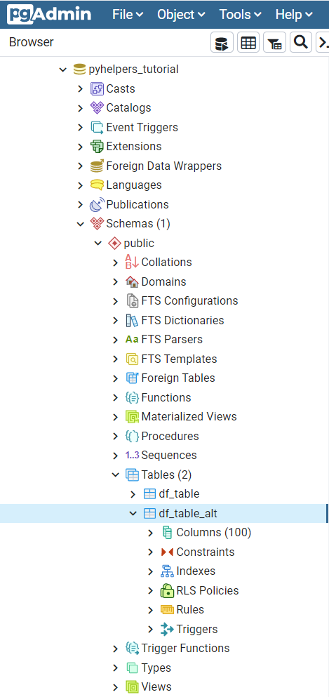

.. _pyhelpers-tutorial:

========
Tutorial
========

This brief tutorial provides a few examples for each of the :ref:`modules<modules>` to demonstrate that what `pyhelpers`_ could offer to assist us in performing data manipulation tasks in our day-to-day work.

.. _`pyhelpers`: https://pypi.org/project/pyhelpers/

.. _tutorial-preparation:

Preparation - Create a data set
===============================

To begin with, let's use `NumPy`_ and `Pandas`_ to create an example data set, which is used throughout this tutorial.

.. _`NumPy`: https://numpy.org/
.. _`Pandas`: https://pandas.pydata.org/

.. note::

    - `NumPy`_ and `Pandas`_ are installed along with the installation of `pyhelpers`_ as they are among the dependencies of the package.

For demonstration purposes, firstly, we can use the function `numpy.random.rand`_ to generate a 100-by-100 Numpy array of random samples drawn from a standard uniform distribution, and name it ``random_array``:

.. _`numpy.random.rand`: https://numpy.org/doc/stable/reference/random/generated/numpy.random.rand.html

.. code-block:: python

    >>> import numpy as np  # Import NumPy and abbreviate it to 'np'

    >>> np.random.seed(0)  # Ensure that the generated array data is reproducible

    >>> random_array = np.random.rand(100, 100)
    >>> random_array
    array([[0.5488135 , 0.71518937, 0.60276338, ..., 0.02010755, 0.82894003,
            0.00469548],
           [0.67781654, 0.27000797, 0.73519402, ..., 0.25435648, 0.05802916,
            0.43441663],
           [0.31179588, 0.69634349, 0.37775184, ..., 0.86219152, 0.97291949,
            0.96083466],
           ...,
           [0.89111234, 0.26867428, 0.84028499, ..., 0.5736796 , 0.73729114,
            0.22519844],
           [0.26969792, 0.73882539, 0.80714479, ..., 0.94836806, 0.88130699,
            0.1419334 ],
           [0.88498232, 0.19701397, 0.56861333, ..., 0.75842952, 0.02378743,
            0.81357508]])

    >>> random_array.shape  # Check the shape of the array
    (100, 100)

Then, we use `pandas.DataFrame`_ to transform ``random_array`` into a Pandas data frame, which is presented in tabular form, and name it ``data_frame``:

.. _`pandas.DataFrame`: https://pandas.pydata.org/pandas-docs/stable/user_guide/dsintro.html#dataframe

.. code-block:: python

    >>> import pandas as pd  # Import Pandas and abbreviate it to 'pd'

    >>> data_frame = pd.DataFrame(random_array, columns=['col_' + str(x) for x in range(100)])
    >>> data_frame
           col_0     col_1     col_2  ...    col_97    col_98    col_99
    0   0.548814  0.715189  0.602763  ...  0.020108  0.828940  0.004695
    1   0.677817  0.270008  0.735194  ...  0.254356  0.058029  0.434417
    2   0.311796  0.696343  0.377752  ...  0.862192  0.972919  0.960835
    3   0.906555  0.774047  0.333145  ...  0.356707  0.016329  0.185232
    4   0.401260  0.929291  0.099615  ...  0.401714  0.248413  0.505866
    ..       ...       ...       ...  ...       ...       ...       ...
    95  0.029929  0.985128  0.094747  ...  0.369907  0.910011  0.142890
    96  0.616935  0.202908  0.288809  ...  0.215006  0.143577  0.933162
    97  0.891112  0.268674  0.840285  ...  0.573680  0.737291  0.225198
    98  0.269698  0.738825  0.807145  ...  0.948368  0.881307  0.141933
    99  0.884982  0.197014  0.568613  ...  0.758430  0.023787  0.813575

    [100 rows x 100 columns]

[See also the example of `saving data as a Pickle file <#tutorial-store-saving-dataframe>`_.]

.. _tutorial-settings-examples:

Alter settings for display of data
==================================

The module :py:mod:`pyhelpers.settings` can be used to alter a few frequently-used parameters (of `GDAL`_, `Matplotlib`_, `NumPy`_ and `Pandas`_) such that the working environment is adapted to suit our own preferences. For example, we could apply the function :py:func:`np_preferences<pyhelpers.settings.np_preferences>` with its default parameters whereby we may have a 'neater' view of the ``random_array``:

.. _`Matplotlib`: https://matplotlib.org/
.. _`GDAL`: https://gdal.org/

.. code-block:: python

    >>> from pyhelpers.settings import np_preferences

    >>> # To round the numbers to four decimal places
    >>> np_preferences()  # By default, reset=False and precision=4

    >>> random_array
    array([[0.5488, 0.7152, 0.6028, 0.5449, 0.4237, ..., 0.1832, 0.5865, 0.0201, 0.8289, 0.0047],
           [0.6778, 0.2700, 0.7352, 0.9622, 0.2488, ..., 0.4905, 0.2274, 0.2544, 0.0580, 0.4344],
           [0.3118, 0.6963, 0.3778, 0.1796, 0.0247, ..., 0.2243, 0.0978, 0.8622, 0.9729, 0.9608],
           [0.9066, 0.7740, 0.3331, 0.0811, 0.4072, ..., 0.9590, 0.3554, 0.3567, 0.0163, 0.1852],
           [0.4013, 0.9293, 0.0996, 0.9453, 0.8695, ..., 0.2717, 0.4554, 0.4017, 0.2484, 0.5059],
           ...,
           [0.0299, 0.9851, 0.0947, 0.4510, 0.8387, ..., 0.1239, 0.2947, 0.3699, 0.9100, 0.1429],
           [0.6169, 0.2029, 0.2888, 0.4451, 0.5472, ..., 0.4776, 0.8664, 0.2150, 0.1436, 0.9332],
           [0.8911, 0.2687, 0.8403, 0.7570, 0.9954, ..., 0.9835, 0.4088, 0.5737, 0.7373, 0.2252],
           [0.2697, 0.7388, 0.8071, 0.2006, 0.3087, ..., 0.5063, 0.2319, 0.9484, 0.8813, 0.1419],
           [0.8850, 0.1970, 0.5686, 0.9310, 0.5645, ..., 0.5504, 0.3972, 0.7584, 0.0238, 0.8136]])

To reset the display, we can set ``reset=True`` by which the altered parameters are reset to their default values:

.. code-block:: python

    >>> np_preferences(reset=True)

    >>> random_array
    array([[0.54881350, 0.71518937, 0.60276338, ..., 0.02010755, 0.82894003,
            0.00469548],
           [0.67781654, 0.27000797, 0.73519402, ..., 0.25435648, 0.05802916,
            0.43441663],
           [0.31179588, 0.69634349, 0.37775184, ..., 0.86219152, 0.97291949,
            0.96083466],
           ...,
           [0.89111234, 0.26867428, 0.84028499, ..., 0.57367960, 0.73729114,
            0.22519844],
           [0.26969792, 0.73882539, 0.80714479, ..., 0.94836806, 0.88130699,
            0.14193340],
           [0.88498232, 0.19701397, 0.56861333, ..., 0.75842952, 0.02378743,
            0.81357508]])

.. note::

    - Basically, the function :py:func:`np_preferences<pyhelpers.settings.np_preferences>` inherits the functionality of `numpy.set_printoptions`_, but with some modifications.

.. _numpy.set_printoptions: https://numpy.org/doc/stable/reference/generated/numpy.set_printoptions.html

For another example, the function :py:func:`pd_preferences<pyhelpers.settings.pd_preferences>` alters a few `Pandas`_ `options and settings`_, such as representation and maximum number of columns when displaying a `pandas.DataFrame`_. Applying the function with its default parameters should allow us to view all the 100 columns and the precision of numbers changes to four decimal places.

.. _`options and settings`: https://pandas.pydata.org/pandas-docs/stable/user_guide/options.html

.. only:: html

    .. code-block:: python

        >>> from pyhelpers.settings import pd_preferences

        >>> pd_preferences()  # By default, reset=False and precision=4

        >>> data_frame
            col_0  col_1  col_2  col_3  col_4  col_5  col_6  col_7  col_8  col_9  col_10  col_11  col_12  col_13  col_14  col_15  col_16  col_17  col_18  col_19  col_20  col_21  col_22  col_23  col_24  col_25  col_26  col_27  col_28  col_29  col_30  col_31  col_32  col_33  col_34  col_35  col_36  col_37  col_38  col_39  col_40  col_41  col_42  col_43  col_44  col_45  col_46  col_47  col_48  col_49  col_50  col_51  col_52  col_53  col_54  col_55  col_56  col_57  col_58  col_59  col_60  col_61  col_62  col_63  col_64  col_65  col_66  col_67  col_68  col_69  col_70  col_71  col_72  col_73  col_74  col_75  col_76  col_77  col_78  col_79  col_80  col_81  col_82  col_83  col_84  col_85  col_86  col_87  col_88  col_89  col_90  col_91  col_92  col_93  col_94  col_95  col_96  col_97  col_98  col_99
        0  0.5488 0.7152 0.6028 0.5449 0.4237 0.6459 0.4376 0.8918 0.9637 0.3834  0.7917  0.5289  0.5680  0.9256  0.0710  0.0871  0.0202  0.8326  0.7782  0.8700  0.9786  0.7992  0.4615  0.7805  0.1183  0.6399  0.1434  0.9447  0.5218  0.4147  0.2646  0.7742  0.4562  0.5684  0.0188  0.6176  0.6121  0.6169  0.9437  0.6818  0.3595  0.4370  0.6976  0.0602  0.6668  0.6706  0.2104  0.1289  0.3154  0.3637  0.5702  0.4386  0.9884  0.1020  0.2089  0.1613  0.6531  0.2533  0.4663  0.2444  0.1590  0.1104  0.6563  0.1382  0.1966  0.3687  0.8210  0.0971  0.8379  0.0961  0.9765  0.4687  0.9768  0.6048  0.7393  0.0392  0.2828  0.1202  0.2961  0.1187  0.3180  0.4143  0.0641  0.6925  0.5666  0.2654  0.5232  0.0939  0.5759  0.9293  0.3186  0.6674  0.1318  0.7163  0.2894  0.1832  0.5865  0.0201  0.8289  0.0047
        1  0.6778 0.2700 0.7352 0.9622 0.2488 0.5762 0.5920 0.5723 0.2231 0.9527  0.4471  0.8464  0.6995  0.2974  0.8138  0.3965  0.8811  0.5813  0.8817  0.6925  0.7253  0.5013  0.9561  0.6440  0.4239  0.6064  0.0192  0.3016  0.6602  0.2901  0.6180  0.4288  0.1355  0.2983  0.5700  0.5909  0.5743  0.6532  0.6521  0.4314  0.8965  0.3676  0.4359  0.8919  0.8062  0.7039  0.1002  0.9195  0.7142  0.9988  0.1494  0.8681  0.1625  0.6156  0.1238  0.8480  0.8073  0.5691  0.4072  0.0692  0.6974  0.4535  0.7221  0.8664  0.9755  0.8558  0.0117  0.3600  0.7300  0.1716  0.5210  0.0543  0.2000  0.0185  0.7937  0.2239  0.3454  0.9281  0.7044  0.0318  0.1647  0.6215  0.5772  0.2379  0.9342  0.6140  0.5356  0.5899  0.7301  0.3119  0.3982  0.2098  0.1862  0.9444  0.7396  0.4905  0.2274  0.2544  0.0580  0.4344
        2  0.3118 0.6963 0.3778 0.1796 0.0247 0.0672 0.6794 0.4537 0.5366 0.8967  0.9903  0.2169  0.6631  0.2633  0.0207  0.7584  0.3200  0.3835  0.5883  0.8310  0.6290  0.8727  0.2735  0.7980  0.1856  0.9528  0.6875  0.2155  0.9474  0.7309  0.2539  0.2133  0.5182  0.0257  0.2075  0.4247  0.3742  0.4636  0.2776  0.5868  0.8639  0.1175  0.5174  0.1321  0.7169  0.3961  0.5654  0.1833  0.1448  0.4881  0.3556  0.9404  0.7653  0.7487  0.9037  0.0834  0.5522  0.5845  0.9619  0.2921  0.2408  0.1003  0.0164  0.9295  0.6699  0.7852  0.2817  0.5864  0.0640  0.4856  0.9775  0.8765  0.3382  0.9616  0.2317  0.9493  0.9414  0.7992  0.6304  0.8743  0.2930  0.8489  0.6179  0.0132  0.3472  0.1481  0.9818  0.4784  0.4974  0.6395  0.3686  0.1369  0.8221  0.1898  0.5113  0.2243  0.0978  0.8622  0.9729  0.9608
        3  0.9066 0.7740 0.3331 0.0811 0.4072 0.2322 0.1325 0.0534 0.7256 0.0114  0.7706  0.1469  0.0795  0.0896  0.6720  0.2454  0.4205  0.5574  0.8606  0.7270  0.2703  0.1315  0.0554  0.3016  0.2621  0.4561  0.6833  0.6956  0.2835  0.3799  0.1812  0.7885  0.0568  0.6970  0.7787  0.7774  0.2594  0.3738  0.5876  0.2728  0.3709  0.1971  0.4599  0.0446  0.7998  0.0770  0.5188  0.3068  0.5775  0.9594  0.6456  0.0354  0.4304  0.5100  0.5362  0.6814  0.2776  0.1289  0.3927  0.9564  0.1871  0.9040  0.5438  0.4569  0.8820  0.4586  0.7242  0.3990  0.9040  0.6900  0.6996  0.3277  0.7568  0.6361  0.2400  0.1605  0.7964  0.9592  0.4581  0.5910  0.8577  0.4572  0.9519  0.5758  0.8208  0.9088  0.8155  0.1594  0.6289  0.3984  0.0627  0.4240  0.2587  0.8490  0.0333  0.9590  0.3554  0.3567  0.0163  0.1852
        4  0.4013 0.9293 0.0996 0.9453 0.8695 0.4542 0.3267 0.2327 0.6145 0.0331  0.0156  0.4288  0.0681  0.2519  0.2212  0.2532  0.1311  0.0120  0.1155  0.6185  0.9743  0.9903  0.4091  0.1630  0.6388  0.4903  0.9894  0.0653  0.7832  0.2884  0.2414  0.6625  0.2461  0.6659  0.5173  0.4241  0.5547  0.2871  0.7066  0.4149  0.3605  0.8287  0.9250  0.0460  0.2326  0.3485  0.8150  0.9855  0.9690  0.9049  0.2966  0.9920  0.2494  0.1059  0.9510  0.2334  0.6898  0.0584  0.7307  0.8817  0.2724  0.3791  0.3743  0.7488  0.2378  0.1719  0.4493  0.3045  0.8392  0.2377  0.5024  0.9426  0.6340  0.8673  0.9402  0.7508  0.6996  0.9680  0.9944  0.4518  0.0709  0.2928  0.1524  0.4175  0.1313  0.6041  0.3828  0.8954  0.9678  0.5469  0.2748  0.5922  0.8968  0.4067  0.5521  0.2717  0.4554  0.4017  0.2484  0.5059
        ..    ...    ...    ...    ...    ...    ...    ...    ...    ...    ...     ...     ...     ...     ...     ...     ...     ...     ...     ...     ...     ...     ...     ...     ...     ...     ...     ...     ...     ...     ...     ...     ...     ...     ...     ...     ...     ...     ...     ...     ...     ...     ...     ...     ...     ...     ...     ...     ...     ...     ...     ...     ...     ...     ...     ...     ...     ...     ...     ...     ...     ...     ...     ...     ...     ...     ...     ...     ...     ...     ...     ...     ...     ...     ...     ...     ...     ...     ...     ...     ...     ...     ...     ...     ...     ...     ...     ...     ...     ...     ...     ...     ...     ...     ...     ...     ...     ...     ...     ...     ...
        95 0.0299 0.9851 0.0947 0.4510 0.8387 0.4216 0.2488 0.4140 0.8239 0.0449  0.4888  0.1935  0.0603  0.7856  0.0145  0.4150  0.5455  0.1729  0.8995  0.4087  0.1821  0.6112  0.6394  0.3887  0.0315  0.6616  0.2378  0.1499  0.8209  0.5042  0.4479  0.7548  0.4707  0.6118  0.4062  0.8875  0.5656  0.9025  0.8988  0.7586  0.5481  0.6542  0.2221  0.9191  0.8597  0.7871  0.0255  0.1945  0.9167  0.8091  0.8462  0.4046  0.2564  0.8907  0.3730  0.2989  0.3009  0.8824  0.1769  0.8330  0.4776  0.2611  0.5842  0.2790  0.5149  0.6137  0.5830  0.8162  0.6188  0.2206  0.2949  0.4022  0.7695  0.9042  0.0245  0.9934  0.4915  0.1317  0.5654  0.4585  0.0493  0.5776  0.9316  0.4726  0.2292  0.6709  0.2676  0.9152  0.4770  0.7846  0.0491  0.7325  0.1480  0.2177  0.8613  0.1239  0.2947  0.3699  0.9100  0.1429
        96 0.6169 0.2029 0.2888 0.4451 0.5472 0.1754 0.5955 0.6072 0.4085 0.2007  0.3339  0.0980  0.7448  0.0146  0.3318  0.9243  0.1875  0.5235  0.1492  0.9498  0.8206  0.3126  0.7519  0.5674  0.2217  0.1344  0.2492  0.6290  0.9548  0.7769  0.9035  0.1941  0.9146  0.0847  0.9442  0.1412  0.3615  0.3456  0.3299  0.7366  0.8395  0.5705  0.5461  0.2613  0.9033  0.5648  0.4113  0.5595  0.1045  0.1114  0.9273  0.2186  0.2703  0.5572  0.4869  0.5557  0.3654  0.4052  0.1688  0.4970  0.4230  0.9401  0.1298  0.6157  0.9665  0.0980  0.7211  0.8655  0.3322  0.5694  0.0896  0.3371  0.2488  0.6854  0.0557  0.4832  0.5538  0.9313  0.9211  0.0066  0.5810  0.3998  0.5363  0.6496  0.2744  0.7612  0.9205  0.8888  0.7553  0.5245  0.4852  0.7450  0.7727  0.0121  0.0378  0.4776  0.8664  0.2150  0.1436  0.9332
        97 0.8911 0.2687 0.8403 0.7570 0.9954 0.1634 0.8974 0.0570 0.6731 0.6692  0.9157  0.2279  0.1716  0.5135  0.9526  0.2789  0.7967  0.3199  0.2551  0.6841  0.7714  0.0131  0.5836  0.5309  0.3890  0.7853  0.3559  0.5440  0.4279  0.4481  0.4856  0.1562  0.8035  0.2906  0.5163  0.2731  0.8593  0.8317  0.9506  0.3643  0.8870  0.8589  0.5738  0.1476  0.7041  0.9448  0.8193  0.0765  0.0225  0.4606  0.9130  0.7224  0.9994  0.6273  0.8822  0.8120  0.5386  0.0905  0.1308  0.8155  0.3694  0.6026  0.2917  0.8915  0.9160  0.9557  0.9286  0.5640  0.6019  0.9622  0.3726  0.6308  0.4397  0.3447  0.9294  0.5696  0.4651  0.0541  0.1555  0.5407  0.9946  0.4594  0.6252  0.8517  0.9184  0.3661  0.1636  0.9713  0.5275  0.8858  0.2985  0.0887  0.8784  0.4166  0.4406  0.9835  0.4088  0.5737  0.7373  0.2252
        98 0.2697 0.7388 0.8071 0.2006 0.3087 0.0087 0.3848 0.9011 0.4013 0.7590  0.0574  0.5879  0.9540  0.9844  0.5784  0.0143  0.8399  0.7347  0.0247  0.7567  0.7195  0.0966  0.5364  0.5489  0.8949  0.4431  0.5592  0.5509  0.5194  0.8532  0.9466  0.9149  0.1965  0.8680  0.3178  0.0128  0.5331  0.0943  0.4993  0.7398  0.8458  0.3228  0.8388  0.0571  0.6156  0.3496  0.5488  0.1919  0.2312  0.8364  0.7976  0.8543  0.4784  0.6621  0.4582  0.2491  0.0062  0.9198  0.6971  0.7818  0.0741  0.8829  0.1467  0.8430  0.7647  0.7388  0.6872  0.2025  0.6578  0.1086  0.8596  0.2004  0.4396  0.9060  0.7954  0.0381  0.4885  0.5251  0.8353  0.5970  0.0659  0.4197  0.6602  0.9880  0.3841  0.9846  0.5489  0.4638  0.4154  0.5793  0.4285  0.3835  0.9782  0.4945  0.7802  0.5063  0.2319  0.9484  0.8813  0.1419
        99 0.8850 0.1970 0.5686 0.9310 0.5645 0.2116 0.2650 0.6786 0.7470 0.5918  0.2814  0.1868  0.6546  0.2293  0.1628  0.1311  0.7388  0.7119  0.9275  0.2617  0.5895  0.9196  0.2235  0.4540  0.9658  0.9549  0.5116  0.4487  0.9448  0.5995  0.2469  0.5173  0.5726  0.5523  0.4057  0.1464  0.8681  0.1123  0.1395  0.1492  0.0394  0.8577  0.8917  0.1226  0.4616  0.3932  0.1262  0.8644  0.8641  0.7408  0.1666  0.2636  0.1923  0.8325  0.4676  0.1504  0.0101  0.2785  0.9741  0.0317  0.9115  0.0579  0.6718  0.3497  0.4555  0.2211  0.3385  0.3081  0.7089  0.8713  0.4093  0.8162  0.0115  0.7877  0.5260  0.8337  0.2240  0.3767  0.6977  0.8484  0.4783  0.8464  0.5483  0.9914  0.9047  0.3856  0.9555  0.7653  0.5255  0.9910  0.6950  0.1946  0.1140  0.2621  0.7355  0.5504  0.3972  0.7584  0.0238  0.8136

        [100 rows x 100 columns]

.. only:: latex

    .. code-block:: python

        >>> from pyhelpers.settings import pd_preferences

        >>> pd_preferences()  # By default, reset=False and precision=4

        >>> data_frame
            col_0  col_1  col_2  col_3  col_4  col_5  col_6  col_7  col_8  col_9  col_10  col_11 ...
        0  0.5488 0.7152 0.6028 0.5449 0.4237 0.6459 0.4376 0.8918 0.9637 0.3834  0.7917  0.5289 ...
        1  0.6778 0.2700 0.7352 0.9622 0.2488 0.5762 0.5920 0.5723 0.2231 0.9527  0.4471  0.8464 ...
        2  0.3118 0.6963 0.3778 0.1796 0.0247 0.0672 0.6794 0.4537 0.5366 0.8967  0.9903  0.2169 ...
        3  0.9066 0.7740 0.3331 0.0811 0.4072 0.2322 0.1325 0.0534 0.7256 0.0114  0.7706  0.1469 ...
        4  0.4013 0.9293 0.0996 0.9453 0.8695 0.4542 0.3267 0.2327 0.6145 0.0331  0.0156  0.4288 ...
        ..    ...    ...    ...    ...    ...    ...    ...    ...    ...    ...     ...     ... ...
        95 0.0299 0.9851 0.0947 0.4510 0.8387 0.4216 0.2488 0.4140 0.8239 0.0449  0.4888  0.1935 ...
        96 0.6169 0.2029 0.2888 0.4451 0.5472 0.1754 0.5955 0.6072 0.4085 0.2007  0.3339  0.0980 ...
        97 0.8911 0.2687 0.8403 0.7570 0.9954 0.1634 0.8974 0.0570 0.6731 0.6692  0.9157  0.2279 ...
        98 0.2697 0.7388 0.8071 0.2006 0.3087 0.0087 0.3848 0.9011 0.4013 0.7590  0.0574  0.5879 ...
        99 0.8850 0.1970 0.5686 0.9310 0.5645 0.2116 0.2650 0.6786 0.7470 0.5918  0.2814  0.1868 ...

        [100 rows x 100 columns]

    .. note::

        - Here the columns from ``'col_12'`` to ``'col_99'`` are omitted from the above demonstration due to the limit of the page width.

Similarly, :py:func:`pd_preferences<pyhelpers.settings.pd_preferences>` also offers a parameter ``reset``, which defaults to ``False``; by setting ``reset=True``, the altered parameters are reset to their default values. In addition, we can also set ``reset='all'`` to reset all Pandas options to their default values, if needed.

.. code-block:: python

    >>> pd_preferences(reset=True)

    >>> data_frame
           col_0     col_1     col_2  ...    col_97    col_98    col_99
    0   0.548814  0.715189  0.602763  ...  0.020108  0.828940  0.004695
    1   0.677817  0.270008  0.735194  ...  0.254356  0.058029  0.434417
    2   0.311796  0.696343  0.377752  ...  0.862192  0.972919  0.960835
    3   0.906555  0.774047  0.333145  ...  0.356707  0.016329  0.185232
    4   0.401260  0.929291  0.099615  ...  0.401714  0.248413  0.505866
    ..       ...       ...       ...  ...       ...       ...       ...
    95  0.029929  0.985128  0.094747  ...  0.369907  0.910011  0.142890
    96  0.616935  0.202908  0.288809  ...  0.215006  0.143577  0.933162
    97  0.891112  0.268674  0.840285  ...  0.573680  0.737291  0.225198
    98  0.269698  0.738825  0.807145  ...  0.948368  0.881307  0.141933
    99  0.884982  0.197014  0.568613  ...  0.758430  0.023787  0.813575

    [100 rows x 100 columns]

.. note::

    - The functions that are currently available in the module :py:mod:`pyhelpers.settings` handle only a few parameters for the author's personal preference. We may change the source code as appropriate to adapt the settings to different tastes.

.. _tutorial-dir-examples:

Specify a directory or a file path
==================================

The module :py:mod:`pyhelpers.dir` offers to assist with manipulating folders/directories. For example, the function :py:func:`cd<pyhelpers.dir.cd>` returns an absolute path to the current working directory or, if specified, to a subdirectory or a file any level deep from the current working directory:

.. code-block:: python

    >>> from pyhelpers.dir import cd
    >>> import os

    >>> cwd = cd()  # The current working directory

    >>> # Relative path of `cwd` to the current working directory
    >>> rel_path_cwd = os.path.relpath(cwd)
    >>> print(rel_path_cwd)
    .

To specify a path to a temporary folder, named ``"pyhelpers_tutorial"``:

.. code-block:: python

    >>> # Name of a temporary folder for this tutorial
    >>> dir_name = "pyhelpers_tutorial"

    >>> # Path to the folder "pyhelpers_tutorial"
    >>> path_to_dir = cd(dir_name)

    >>> # Relative path of the directory
    >>> rel_dir_path = os.path.relpath(path_to_dir)
    >>> print(rel_dir_path)
    pyhelpers_tutorial

Check whether the directory ``"pyhelpers_tutorial\"`` exists:

.. code-block:: python

    >>> print(f'The directory "{rel_dir_path}\\" exists? {os.path.exists(path_to_dir)}')
    The directory "pyhelpers_tutorial\" exists? False

If the directory ``"pyhelpers_tutorial\"`` does not exist, we could set the parameter ``mkdir=True`` by which the directory should be created as we specify the path:

.. code-block:: python

    >>> # Set `mkdir` to be `True` to create a folder named "pyhelpers_tutorial"
    >>> path_to_dir = cd(dir_name, mkdir=True)

    >>> # Check again whether the directory "pyhelpers_tutorial\" exists
    >>> print(f'The directory "{rel_dir_path}\\" exists? {os.path.exists(path_to_dir)}')
    The directory "pyhelpers_tutorial\" exists? True

When we specify a sequence of names (in order with a filename being the last), the function :py:func:`cd<pyhelpers.dir.cd>` would assume that all the names prior to the filename are folder names, which specify a path to the file. For example, let's specify a path to a file named ``"quick_start.dat"``:

.. code-block:: python

    >>> # Name of a file
    >>> filename = "quick_start.dat"

    >>> # Path to the file named "quick_start.dat"
    >>> path_to_file = cd(dir_name, filename)  # path_to_file = cd(path_to_dir, filename)

    >>> # Relative path of the file "quick_start.dat"
    >>> rel_file_path = os.path.relpath(path_to_file)
    >>> print(rel_file_path)
    pyhelpers_tutorial\quick_start.dat

If any of the folders/subfolders of a specified path does not exist, setting ``mkdir=True`` should enable the function :py:func:`cd<pyhelpers.dir.cd>` to create all the missing ones along the path. For example, let's specify a data directory, named ``"data"``, which is contained within the folder ``"pyhelpers_tutorial"``:

.. code-block:: python

    >>> # Path to a data directory
    >>> data_dir = cd("pyhelpers_tutorial", "data")  # equivalent to `cd(path_to_dir, "data")`

    >>> # Relative path of the data directory
    >>> rel_data_dir = os.path.relpath(data_dir)
    >>> print(rel_data_dir)
    pyhelpers_tutorial\data

We can use the function :py:func:`is_dir<pyhelpers.dir.is_dir>` to examine whether ``data_dir`` (or ``rel_data_dir``) specifies a path (or a relative path) to a directory:

.. code-block:: python

    >>> from pyhelpers.dir import is_dir

    >>> # Check whether `rel_data_dir` specifies a (relative) path to a directory
    >>> print(f'`rel_data_dir` specifies a directory pathname? {is_dir(rel_data_dir)}')
    `rel_data_dir` specifies a directory pathname? True

    >>> # Check whether the data directory exists
    >>> print(f'The directory "{rel_data_dir}\\" exists? {os.path.exists(rel_data_dir)}')
    The directory "pyhelpers_tutorial\data\" exists? False

.. _tutorial-dir-pickle-pathname:

For another example, let's specify a path to a Pickle file, named ``"dat.pickle"``, in the directory ``"pyhelpers_tutorial\data\"``:

.. code-block:: python

    >>> # Filename of a Pickle file
    >>> pickle_filename = "dat.pickle"

    >>> # Path to the Pickle file, i.e. cd("pyhelpers_tutorial", "data", "dat.pickle")
    >>> path_to_pickle = cd(data_dir, pickle_filename)

    >>> # Relative path of the Pickle file
    >>> rel_pickle_path = os.path.relpath(path_to_pickle)
    >>> print(rel_pickle_path)
    pyhelpers_tutorial\data\dat.pickle

Examine ``rel_pickle_path`` (or ``path_to_pickle``):

.. code-block:: python

    >>> # Check whether `rel_pickle_path` specifies a directory
    >>> print(f'`rel_pickle_path` specifies a directory? {os.path.isdir(rel_pickle_path)}')
    `rel_pickle_path` specifies a directory? False

    >>> # Check whether the file "dat.pickle" exists
    >>> print(f'The file "{rel_pickle_path}" exists? {os.path.exists(rel_pickle_path)}')
    The file "pyhelpers_tutorial\data\dat.pickle" exists? False

Let's now set the parameter ``mkdir`` to be ``True``:

.. code-block:: python

    >>> path_to_pickle = cd(data_dir, pickle_filename, mkdir=True)
    >>> rel_data_dir = os.path.relpath(data_dir)

    >>> # Check again whether the data directory exists
    >>> print(f'The directory "{rel_data_dir}\\" exists? {os.path.exists(rel_data_dir)}')
    The directory "pyhelpers_tutorial\data\" exists? True

    >>> # Check again whether the file "dat.pickle" exists
    >>> print(f'The file "{rel_pickle_path}" exists? {os.path.exists(rel_pickle_path)}')
    The file "pyhelpers_tutorial\data\dat.pickle" exists? False

[See also the example of `saving data as a Pickle file <#tutorial-store-saving-dataframe>`_.]

To delete the directory `"pyhelpers_tutorial\"` (and all contained within it), we can use the function :py:func:`delete_dir<pyhelpers.dir.delete_dir>`:

.. code-block:: python

    >>> from pyhelpers.dir import delete_dir

    >>> # Delete the directory "pyhelpers_tutorial\"
    >>> delete_dir(path_to_dir, verbose=True)
    The directory "pyhelpers_tutorial\" is not empty.
    Confirmed to delete it
    ? [No]|Yes: yes
    Deleting "pyhelpers_tutorial\" ... Done.

.. _tutorial-store-examples:

Save data to / load data from a Pickle file
===========================================

The module :py:mod:`pyhelpers.store` can facilitate tasks such as saving our data to, and loading the data from, file-like objects of some popular formats, such as `CSV`_, `JSON`_ and `Pickle`_.

.. _`Pickle`: https://docs.python.org/3/library/pickle.html
.. _`CSV`: https://en.wikipedia.org/wiki/Comma-separated_values
.. _`JSON`: https://www.json.org/json-en.html

.. _tutorial-store-saving-dataframe:

For example, we could save the ``data_frame`` that has been created in the [Preparation](#tutorial-preparation) section as a `Pickle`_ file by using the functions :py:func:`save_pickle<pyhelpers.store.save_pickle>` and retrieve it later by using :py:func:`load_pickle<pyhelpers.store.load_pickle>`. Firstly, let's save ``data_frame`` to ``path_to_pickle``, which has been specified in the :ref:`Specify a directory or a file path<tutorial-dir-pickle-pathname>` section:

.. code-block:: python

    >>> from pyhelpers.store import save_pickle, load_pickle

    >>> # Write `data_frame` to the file "dat.pickle"
    >>> save_pickle(data_frame, path_to_pickle, verbose=True)
    Saving "dat.pickle" to "pyhelpers_tutorial\data\" ... Done.

Now, we can retrieve the data from ``path_to_pickle`` and store the retrieved data in another variable named ``df_retrieved``:

.. code-block:: python

    >>> df_retrieved = load_pickle(path_to_pickle, verbose=True)
    Loading "pyhelpers_tutorial\data\dat.pickle" ... Done.

Check whether ``df_retrieved`` is equal to ``data_frame`` (namely, whether they have the same shape and elements):

.. code-block:: python

    >>> print(f'`df_retrieved` is equal to `data_frame`? {df_retrieved.equals(data_frame)}')
    `df_retrieved` is equal to `data_frame`? True

Before we move on, let's delete again the Pickle file (i.e. ``path_to_pickle``) and the directory created in the above example:

.. code-block:: python

    >>> delete_dir(path_to_dir, verbose=True)
    The directory "pyhelpers_tutorial\" is not empty.
    Confirmed to delete it
    ? [No]|Yes: yes
    Deleting "pyhelpers_tutorial\" ... Done.

.. note::

    - In the module :py:mod:`store<pyhelpers.store>`, some functions such as :py:func:`save_spreadsheet<pyhelpers.store.save_spreadsheet>` and :py:func:`save_multiple_spreadsheets<pyhelpers.store.save_multiple_spreadsheets>` may require `openpyxl`_, `XlsxWriter`_ or `xlrd`_, which are NOT essential dependencies for the installation of `pyhelpers`_. We could install them as needed via an appropriate method such as ``pip install``.

.. _openpyxl: https://pypi.org/project/openpyxl/
.. _XlsxWriter: https://pypi.org/project/XlsxWriter/
.. _xlrd: https://pypi.org/project/xlrd/

.. _tutorial-geom-examples:

Convert coordinates between `OSGB36`_ and `WGS84`_
==================================================

.. _`OSGB36`: https://en.wikipedia.org/wiki/Ordnance_Survey_National_Grid
.. _`WGS84`: https://en.wikipedia.org/wiki/World_Geodetic_System

The module :py:mod:`pyhelpers.geom` can assist us in manipulating geometric and geographical data. For example, we can use the function :py:func:`osgb36_to_wgs84<pyhelpers.geom.osgb36_to_wgs84>` to convert coordinates from `OSGB36`_ (British national grid) to `WGS84`_ (latitude and longitude):

.. code-block:: python

    >>> from pyhelpers.geom import osgb36_to_wgs84

    >>> # To convert coordinate of a single point (530034, 180381):
    >>> easting, northing = 530034, 180381  # London

    >>> longitude, latitude = osgb36_to_wgs84(easting, northing)  # Longitude and latitude
    >>> (longitude, latitude)
    (-0.12772400574286916, 51.50740692743041)

We could also use the function to convert an array of OSGB36 coordinates:

.. code-block:: python

    >>> xy_array = np.array([(530034, 180381),   # London
    ...                      (406689, 286822),   # Birmingham
    ...                      (383819, 398052),   # Manchester
    ...                      (582044, 152953)],  # Leeds
    ...                     dtype=np.int64)
    >>> eastings, northings = xy_array.T

    >>> lonlat_array = osgb36_to_wgs84(eastings, northings, as_array=True)
    >>> lonlat_array
    array([[-0.12772401, 51.50740693],
           [-1.90294064, 52.47928436],
           [-2.24527795, 53.47894006],
           [ 0.60693267, 51.24669501]])

Similarly, we can convert from the (longitude, latitude) back to (easting, northing) by using the function :py:func:`wgs84_to_osgb36<pyhelpers.geom.wgs84_to_osgb36>`:

.. code-block:: python

    >>> from pyhelpers.geom import wgs84_to_osgb36

    >>> longitudes, latitudes = lonlat_array.T

    >>> xy_array_ = wgs84_to_osgb36(longitudes, latitudes, as_array=True)
    >>> xy_array_
    array([[530034.00088084, 180380.99951018],
           [406689.00082267, 286821.99957672],
           [383819.00081883, 398051.99967237],
           [582044.00090117, 152952.99950009]])

.. note::

    - Conversion of coordinates between different systems may inevitably introduce errors, which are mostly negligible.

Check whether ``xy_array_`` is almost equal to ``xy_array``:

.. code-block:: python

    >>> eq_res = np.array_equal(xy_array, np.round(xy_array_))
    >>> print(f'`xy_array_` is almost equal to `xy_array`? {eq_res}')
    `xy_array_` is almost equal to `xy_array`? True

.. _tutorial-text-examples:

Find similar texts
==================

The module :py:mod:`pyhelpers.text` can assist us in manipulating textual data. For example, suppose we have a word ``'angle'``, which is stored in a `str`_-type variable named ``word``, and a list of words, which is stored in a `list`_-type variable named ``lookup_list``; if we'd like to find from the list a one that is most similar to ``'angle'``, we can use the function :py:func:`find_similar_str<pyhelpers.text.find_similar_str>`:

.. _`str`: https://docs.python.org/3/library/stdtypes.html#textseq
.. _`list`: https://docs.python.org/3/library/stdtypes.html#list

.. code-block:: python

    >>> from pyhelpers.text import find_similar_str

    >>> word = 'angle'
    >>> lookup_list = ['Anglia',
    ...                'East Coast',
    ...                'East Midlands',
    ...                'North and East',
    ...                'London North Western',
    ...                'Scotland',
    ...                'South East',
    ...                'Wales',
    ...                'Wessex',
    ...                'Western']

    >>> # Find the most similar word to 'angle'
    >>> result_1 = find_similar_str(word, lookup_list)
    >>> result_1
    'Anglia'

By default, the function relies on `difflib`_ - a Python built-in module - to perform the task. Alternatively, we could also make use of an open-source package, `FuzzyWuzzy`_, via setting the parameter ``processor='fuzzywuzzy'``:

.. _`FuzzyWuzzy`: https://pypi.org/project/fuzzywuzzy/
.. _`difflib`: https://docs.python.org/3/library/difflib.html

.. code-block:: python

    >>> # Find the most similar word to 'angle' by using FuzzyWuzzy
    >>> result_2 = find_similar_str(word, lookup_list, processor='fuzzywuzzy')
    >>> result_2
    'Anglia'

.. note::

    - The package `FuzzyWuzzy`_ is NOT an essential dependency for the installation of pyhelpers>=`1.3.0`_. We need to install it (e.g. via ``pip install``) to make the function run successfully with setting ``processor='fuzzywuzzy'``.
    - In previous versions of pyhelpers (i.e. <=`1.2.14`_), optional values for the parameter ``processor`` include ``'fuzzywuzzy'`` and ``'nltk'``. The latter has been replaced with ``'difflib'`` since `1.2.15`_.

.. _`1.3.0`: https://pypi.org/project/pyhelpers/1.3.0/
.. _`1.2.14`: https://pypi.org/project/pyhelpers/1.2.14/
.. _`1.2.15`: https://pypi.org/project/pyhelpers/1.2.15/

.. _tutorial-ops-examples:

Download an image file
======================

The module :py:mod:`pyhelpers.ops` provides a miscellany of helper functions that may assist with various operations. For example, we can use the function :py:func:`download_file_from_url<pyhelpers.ops.download_file_from_url>` to download a file from a given URL.

Let's now try to download an image file of `Python logo`_ from its `home page <https://www.python.org/>`_. Firstly, we need to specify the URL of the image file:

.. _`Python logo`: https://www.python.org/static/community_logos/python-logo-master-v3-TM.png

.. code-block:: python

    >>> from pyhelpers.ops import download_file_from_url

    >>> # URL of a .png file of the Python logo
    >>> url = 'https://www.python.org/static/community_logos/python-logo-master-v3-TM.png'

Then, we need to specify a directory where we'd like to save the image file, and a filename for it; let's say we want to name the file ``"python-logo.png"`` and save it to the directory ``"pyhelpers_tutorial\images\"``:

.. code-block:: python

    >>> python_logo_filename = "python-logo.png"
    >>> # python_logo_file_path = cd("pyhelpers_tutorial", "images", python_logo_filename)
    >>> python_logo_file_path = cd(path_to_dir, "images", python_logo_filename)

    >>> # Download the .png file of the Python logo
    >>> download_file_from_url(url, python_logo_file_path, verbose=False)

The parameter ``verbose`` is by default ``False``. If we set ``verbose=True``, the function would print out relevant information about the download as the file is being downloaded.

.. note::

    - When ``verbose=True`` (or ``verbose=1``), the function requires an open-source package `tqdm`_, which is NOT an essential dependency for installing pyhelpers>=`1.2.15`_. We can just install the dependency package via ``pip install`` to make the function run successfully.

.. _`tqdm`: https://pypi.org/project/tqdm/

Assuming `tqdm`_ has been installed in our working environment, try:

.. code-block:: python

    >>> download_file_from_url(url, python_logo_file_path, if_exists='replace', verbose=True)
    "pyhelpers_tutorial\images\python-logo.png": 81.6kB [00:00, 10.8MB/s]

.. note::

    - '...MB/s' shown at the end of the output above is an estimated speed of downloading the file, which varies depending on network conditions at the time of running the function.
    - Setting ``if_exists='replace'`` (default) allows us to download the image file again and replace the one that was just downloaded to the specified destination.

Now let's have a look at the downloaded image file by using `Pillow`_:

.. _`Pillow`: https://python-pillow.org/

.. code-block:: python

    >>> from PIL import Image

    >>> python_logo = Image.open(python_logo_file_path)
    >>> python_logo.show()

.. figure:: _images/python-logo.*
    :name: tutorial-python-logo
    :align: center
    :width: 65%

    The Python Logo (for illustration in the brief tutorial).

.. note::

    - In `Jupyter Notebook`_, we may use `IPython.display.Image`_ to display the image in the notebook by running ``IPython.display.Image(python_logo_file_path)``.

.. _`Jupyter Notebook`: https://jupyter.org/
.. _`IPython.display.Image`: https://ipython.readthedocs.io/en/stable/api/generated/IPython.display.html#IPython.display.Image

To delete ``"pyhelpers_tutorial\"`` and the download directory ``"pyhelpers_tutorial\images\"``, again, we can use the function :py:func:`delete_dir<pyhelpers.dir.delete_dir>`:

.. code-block:: python

    >>> delete_dir(path_to_dir, confirmation_required=False, verbose=True)
    Deleting "pyhelpers_tutorial\" ... Done.

Setting the parameter ``confirmation_required=False`` can allow us to delete the directory straightaway without having to type ``yes`` to confirm the action. This is actually implemented through the function :py:func:`confirmed<pyhelpers.ops.confirmed>`, which is also from the module :py:mod:`pyhelpers.ops` and can be helpful especially when we'd like to impose a manual confirmation before proceeding with certain actions. For example:

.. code-block:: python

    >>> from pyhelpers.ops import confirmed

    >>> # We can specify any prompting message as to what needs to be confirmed.
    >>> if confirmed(prompt="Continue? ..."):
    ...     print("OK! Go ahead.")
    Continue? ... [No]|Yes: yes
    OK! Go ahead.

.. note::

    - What we type to respond to the prompting message is case-insensitive. It doesn't have to be precisely ``Yes`` to make the function return ``True``; something like ``yes``, ``Y`` or ``ye`` can do the job as well. If we type ``no`` or ``n``, it returns ``False``.
    - The function also provides a parameter ``confirmation_required``, which defaults to ``True``. If setting ``confirmation_required=False``, a confirmation is not required, in which case this function will become ineffective as it just returns ``True``.

.. _tutorial-sql-examples:

Work with a PostgreSQL server
=============================

The module :py:mod:`pyhelpers.dbms` offers a convenient way of communicating with `databases`_, such as `PostgreSQL`_.

.. _`databases`: https://en.wikipedia.org/wiki/Database
.. _`PostgreSQL`: https://www.postgresql.org/

.. note::

    - The current release of pyhelpers is only able to deal with `PostgreSQL`_ as the module :py:mod:`pyhelpers.dbms` needs to be further developed to work with other types of databases.

The class :py:class:`PostgreSQL<pyhelpers.dbms.PostgreSQL>`, for example, could assist us in executing some basic SQL statements on a PostgreSQL database server. To demonstrate it works, let's start with importing the class:

.. code-block:: python

    >>> from pyhelpers.dbms import PostgreSQL

.. _tutorial-sql-examples-connect-db:

Connect to a database
---------------------

Now, we can create an instance of the class :py:class:`PostgreSQL<pyhelpers.dbms.PostgreSQL>` to connect a PostgreSQL server by specifying the key parameters, including ``host``, ``port``, ``username``, ``database_name`` and ``password``.

.. note::

    - If we leave ``host``, ``port``, ``username`` and ``database_name`` unspecified, their default arguments (namely, ``host='localhost'``, ``port=5432``, ``username='postgres'`` and ``database_name='postgres'``) are passed to instantiate the class, in which case we would connect to the default PostgreSQL server (as is installed on a PC).
    - If the specified ``database_name`` does not exist, it will be automatically created along with the class instantiation.
    - If we prefer not to specify explicitly the parameter ``password``, we could just leave it. In that case, we will be asked to type in the password manually when instantiating the class.

For example, let's create an instance named ``pgdb``, and we'd like to establish a connection with a database named "*pyhelpers_tutorial*", which is hosted at the default PostgreSQL server:

.. code-block:: python

    >>> pgdb = PostgreSQL(database_name="pyhelpers_tutorial")
    Password (postgres@localhost:5432): ***
    Creating a database: "pyhelpers_tutorial" ... Done.
    Connecting postgres:***@localhost:5432/pyhelpers_tutorial ... Successfully.

We can use `pgAdmin`_ - the most popular graphical management tool for PostgreSQL - to check whether the database "*pyhelpers_tutorial*" exists now in the Databases tree of the default server, as illustrated in :numref:`tutorial-sql-examples-db-1`:

.. _`pgAdmin`: https://www.pgadmin.org/

    The database "*pyhelpers_tutorial*".

Alternatively, we could also use the method :py:meth:`.database_exists<pyhelpers.dbms.PostgreSQL.database_exists>`:

.. code-block:: python

    >>> res = pgdb.database_exists("pyhelpers_tutorial")
    >>> print(f'The database "pyhelpers_tutorial" exists? {res}')
    The database "pyhelpers_tutorial" exists? True

    >>> print(f'We are currently connected to the database "{pgdb.database_name}".')
    We are now connected with the database "pyhelpers_tutorial".

In the same server, we can create multiple databases. For example, let's now create another database named "*pyhelpers_tutorial_alt*" by using the method :py:meth:`.create_database<pyhelpers.dbms.PostgreSQL.create_database>`:

.. code-block:: python

    >>> pgdb.create_database("pyhelpers_tutorial_alt", verbose=True)
    Creating a database: "pyhelpers_tutorial_alt" ... Done.

As we can see in :numref:`tutorial-sql-examples-db-2`, the database "*pyhelpers_tutorial_alt*" has now been added to the default *Databases* tree:

.. figure:: _images/tutorial-sql-examples-db-2.png
    :name: tutorial-sql-examples-db-2
    :align: center
    :width: 60%

    The database "*pyhelpers_tutorial_alt*".

.. note::

    - When a new database is created, the instance ``pgdb`` disconnects the currently-connected database and connect to the new one.

Check whether "*pyhelpers_tutorial_alt*" is the database being connected now:

.. code-block:: python

    >>> res = pgdb.database_exists("pyhelpers_tutorial_alt")
    >>> print(f'The database "pyhelpers_tutorial_alt" exists? {res}')
    The database "pyhelpers_tutorial_alt" exists? True

    >>> print(f'We are currently connected to the database "{pgdb.database_name}".')
    We are now connected with the database "pyhelpers_tutorial_alt".

To connect again to "*pyhelpers_tutorial*", we can use the method :py:meth:`.connect_database<pyhelpers.dbms.PostgreSQL.connect_database>`:

.. code-block:: python

    >>> pgdb.connect_database("pyhelpers_tutorial", verbose=True)
    Connecting postgres:***@localhost:5432/pyhelpers_tutorial ... Successfully.

    >>> print(f'We are currently connected to the database "{pgdb.database_name}".')
    We are now connected with the database "pyhelpers_tutorial".

.. _tutorial-sql-examples-import-data:

Import data into a database
---------------------------

With the established connection to the database, we can use the method :py:meth:`.import_data<pyhelpers.dbms.PostgreSQL.import_data>` to import the ``data_frame``, which has been created in the :ref:`Preparation<tutorial-preparation>` section, into a table named "*df_table*" under the default schema "*public*":

.. code-block:: python

    >>> pgdb.import_data(data_frame, table_name="df_table", if_exists='replace', verbose=2)
    To import data into "public"."df_table" at postgres:***@localhost:5432/pyhelpers_tutorial
    ? [No]|Yes: yes
    Importing the data into the table "public"."df_table" ... Done.

We should now be able to see the table in pgAdmin, as illustrated in :numref:`tutorial-sql-examples-df_table`:

    The table *"public"."df_table"*.

The method :py:meth:`.import_data<pyhelpers.dbms.PostgreSQL.import_data>` relies on `pandas.DataFrame.to_sql`_, with the parameter ``method`` being set to be ``'multi'`` by default. Optionally, it can also take the method :py:meth:`.psql_insert_copy<pyhelpers.dbms.PostgreSQL.psql_insert_copy>` as an argument to significantly speed up importing data into a database, especially when the data size is fairly large.

.. _`pandas.DataFrame.to_sql`: https://pandas.pydata.org/pandas-docs/stable/reference/api/pandas.DataFrame.to_sql.html

Let's now try to import the same data into a table named "*df_table_alt*" by setting ``method=pgdb.psql_insert_copy``:

.. code-block:: python

    >>> pgdb.import_data(data_frame, table_name="df_table_alt", method=pgdb.psql_insert_copy,
    ...                  verbose=2)
    To import data into "public"."df_table_alt" at postgres:***@localhost:5432/pyhelpers_tutorial
    ? [No]|Yes: yes
    Importing the data into the table "public"."df_table_alt" ... Done.

In pgAdmin, we can see the table has been added to the *Tables* list, as illustrated in :numref:`tutorial-sql-examples-df_table_alt`:

    The table *"public"."df_table_alt"*.

.. _tutorial-sql-examples-fetch-data:

Fetch data from a database
--------------------------

To retrieve the imported data, we can use the method :py:meth:`.read_table<pyhelpers.dbms.PostgreSQL.read_table>`:

.. code-block:: python

    >>> df_retrieval_1 = pgdb.read_table("df_table")

    >>> res = df_retrieval_1.equals(data_frame)
    >>> print("`df_retrieval_1` is equal to `data_frame`? {}".format(res))
    `df_retrieval_1` is equal to `data_frame`? True

Alternatively, we can also use the method :py:meth:`.read_sql_query<pyhelpers.dbms.PostgreSQL.read_sql_query>`, which serves as a more flexible way of reading/querying data. It takes PostgreSQL statements, and could be much faster when the queried table is fairly large. Let's try this method to fetch the same data from the table "*df_table_alt*":

.. code-block:: python

    >>> df_retrieval_2 = pgdb.read_sql_query(sql_query='SELECT * FROM public.df_table_alt')

    >>> res = df_retrieval_2.round(8).equals(df_retrieval_1.round(8))
    >>> print(f"`df_retrieval_2` is equal to `df_retrieval_1`? {res}")
    `df_retrieval_2` is equal to `df_retrieval_1`? True

.. note::

    - For the method :py:meth:`.read_sql_query<pyhelpers.dbms.PostgreSQL.read_sql_query>`, any PostgreSQL statement that is passed to the parameter ``sql_query`` should NOT end with ``';'``.

.. _tutorial-sql-examples-drop-data:

Drop data
---------

Before we leave this notebook, let's clear up the databases and tables we've created.

We can delete/drop a table (e.g. "*df_table*") by using the method :py:meth:`.drop_table<pyhelpers.dbms.PostgreSQL.drop_table>`:

.. code-block:: python

    >>> pgdb.drop_table(table_name="df_table", verbose=True)
    To drop the table "public"."df_table" from postgres:***@localhost:5432/pyhelpers_tutorial
    ? [No]|Yes: yes
    Dropping "public"."df_table" ... Done.

To delete/drop a database, we can use the method :py:meth:`.drop_database<pyhelpers.dbms.PostgreSQL.drop_database>`:

.. code-block:: python

    >>> # Drop "pyhelpers_tutorial" (i.e. the currently connected database)
    >>> pgdb.drop_database(verbose=True)
    To drop the database "pyhelpers_tutorial" from postgres:***@localhost:5432
    ? [No]|Yes: yes
    Dropping "pyhelpers_tutorial" ... Done.

    >>> # Drop "pyhelpers_tutorial_alt"
    >>> pgdb.drop_database(database_name="pyhelpers_tutorial_alt", verbose=True)
    To drop the database "pyhelpers_tutorial_alt" from postgres:***@localhost:5432
    ? [No]|Yes: yes
    Dropping "pyhelpers_tutorial_alt" ... Done.

Check which database is the one being currently connected:

.. code-block:: python

    >>> print("We are currently connected with the database \"{}\".".format(pgdb.database_name))
    We are currently connected with the database "postgres".

Now we have removed all the databases created above, and restored the PostgreSQL server to its original status.

.. _tutorial-the-end:

**This is the end of the** :ref:`Tutorial<pyhelpers-tutorial>`.

-----------------------------------------------------------------

Any issues regarding the use of the package are all welcome and should be logged/reported onto the `Issue Tracker`_.

.. _`Issue Tracker`: https://github.com/mikeqfu/pyhelpers/issues

For more details and examples, check :ref:`Modules<modules>`.
